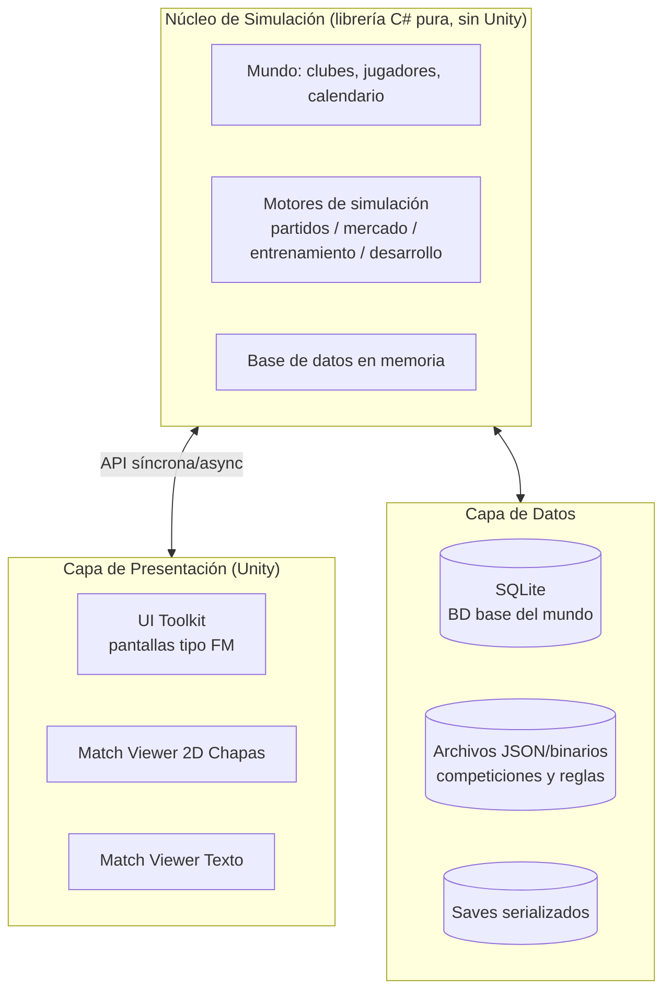

# 🎮 Futsal Manager Estilo FM26 — Stack Técnico y Diseño Completo de Secciones

---

## 1. 🧱 Stack Técnico Recomendado

### 1.1 Motor y Lenguaje

| Componente        | Recomendación           | Justificación                                                                                                                                                                                                                                                                                                              |
| :---------------- | :---------------------- | :------------------------------------------------------------------------------------------------------------------------------------------------------------------------------------------------------------------------------------------------------------------------------------------------------------------------- |
| **Motor**         | **Unity 6 (LTS)**       | Es el **mismo motor que usa Sports Interactive para FM26**. Validación directa de que soporta este tipo de juego. Su sistema **UI Toolkit** está diseñado exactamente para interfaces densas de datos (tablas, paneles, listas con miles de filas), que es el 90% de un juego manager. Exporta nativo a Windows/Mac/Linux. |
| **Lenguaje**      | **C#**                  | Todo el juego (UI, simulación, base de datos) en un solo lenguaje. Ecosistema maduro, LINQ es una bendición para consultas sobre la base de datos de jugadores ("dame todos los alas zurdos menores de 21 años con cláusula < 500k").                                                                                      |

### 1.2 Arquitectura de Software (lo más importante de toda la sección)

El error clásico es acoplar la simulación al motor de juego. **NO lo hagas.** Estructura en capas:

**Principios clave:**

1. **El núcleo es una librería C# pura** (Class Library, sin referencias a UnityEngine). Ventajas enormes:
   - Puedes simular partidos y temporadas **headless** (sin abrir el juego): es lo que permite a FM procesar los resultados de todas las ligas del mundo cuando pulsas "Continuar".
   - Tests unitarios sobre reglas (acumulaciones de faltas, sanciones, calendarios).
   - Herramientas de QA externas: "simula 50 temporadas y detecta que el Real Betis Futsal gana el 90% de las ligas → la IA está rota".
   
2. **Un solo motor de decisión, dos presentadores.** El partido se simula una vez, generando una **secuencia de eventos discretos** (`Minuto 14' — Falta de Pérez sobre Silva, la 5ª acumulada del equipo → doble penalti`). Después:
   - El **visor 2D chapas** anima esos eventos.
   - El **modo texto** los narra.
   - El **resultado instantáneo** solo muestra el resumen final.
   Tres modos de visionado, **una única simulación**. Esto te ahorra la mitad del trabajo del match engine.

3. **Determinismo con seed**: el mismo partido con la misma seed produce el mismo resultado. Permite replay, depuración y resimular desde el histórico de guardados.

### 1.3 Match Engine 2D "Chapas" — Detalle técnico

| Aspecto | Especificación |
| :--- | :--- |
| **Representación** | 10 entidades circulares (5v5) + portero-jugador cuando aplique, sobre pista de 40×20 m vista cenital. Estilo "chapas": fichas planas que se deslizan, balón independiente. |
| **Física** | Física propia simple (no necesitas PhysX/Box2D completo): colisión círculo-círculo, fricción lineal, rebotes con pista. Física **visual**; el resultado del partido se decide por la capa de IA + RNG ponderado por atributos, no por la física. La física solo hace que se vea bien. |
| **IA de partido** | Árboles de decisión por jugador: qué hace con el balón (conducir, pasar, tiro, pared) ponderado por atributos (finalización, pase, visión, decisión) × rol táctico × estado del partido (perdiendo por 2 → power play). |
| **Presentación** | Aceleración ×1, ×2, ×8, "solo momentos clave" (goles, dobles penaltis, tiempos muertos, expulsiones) o solo resultado. |
| **Reglas de futsal implementadas en el motor** | 2×20 min a reloj parado (timeout del juego gestionado aparte), **acumulación de faltas** (a la 6ª falta de equipo en el mismo periodo → doble penalti desde 10 m), **portería-jugador**, **cambios ilimitados** con voleibol de entrada/salida, **tiempo muerto** (1 por equipo y parte), expulsión con 2 min en inferioridad (o reincorporación si encaja gol), saques laterales con pie, saque de meta del portero con manos. |

### 1.4 Datos y Persistencia

| Componente | Recomendación |
| :--- | :--- |
| **Base de datos del mundo** | **SQLite** (envuelta en librería, ej. `sqlite-net-pcl` o Dapper). Tablas: jugadores, personas/staff, clubes, competiciones, temporadas, partidos, contratos, ofertas, instalaciones, histórico. |
| **En memoria durante partida** | Al iniciar, cargas el mundo relevante a objetos C# (un mundo grande de futsal: ~300-600 clubes, ~10.000-15.000 jugadores — trivial para RAM actual). SQLite es el disco; el modelo en memoria es lo que consulta la UI. |
| **Formato de datos editable** | Competiciones, reglas y traducciones en **JSON/CSV fuera del binario** → permite bases de datos de la comunidad (equivalente a los .fmf del FM Editor de SI). |
| **Guardado** | Serialización binaria del estado completo (ej. MemoryPack o MessagePack, muy rápidos). Autosave cada semana de juego. Compatible con **Steam Cloud**. |

### 1.5 UI, Gráficos y Extras

| Componente | Recomendación |
| :--- | :--- |
| **UI** | **UI Toolkit de Unity** (UXML + USS, sintaxis tipo HTML/CSS): listas virtuales con miles de filas sin lag, skin temática, resoluciones escalables. Es literalmente lo que necesitas para pantallas tipo "perfil de jugador" con 100 campos. |
| **Gráficas** | XCharts (gratuito) o custom: líneas de evolución financiera, atributos, forma. |
| **Match Viewer 2D** | Render 2D simple: SpriteRenderer/canvas, pista vectorial, fichas con dorsal y color de equipo. Ball trail, overlays de marcador/faltas acumuladas/tiempo. |
| **Audio** | Ambientación de pabellón (loops de público reactivos a eventos), SFX de silbato/balón, música licencia-libre. Sin comentarista en v1 (con el modo texto ya cubres la narración). |
| **Plataforma/Distribución** | **Steamworks.NET**: logros, Steam Cloud, **Steam Workshop** (¡para compartir bases de datos y editor! — enorme valor para la longevidad),_FULLSCREEN, Achievements. |
| **Localización** | i18n propio con tablas clave→cadena (Español, Inglés, Portugués, Italiano...). El futsal tiene mercado natural en España, Brasil, Portugal, Italia, Argentina, Tailandia, Kazajistán, Irán. |
| **Editor de datos** | Herramienta separada (puede ser la misma app de Unity en modo editor o un ejecutable aparte) para crear/editar clubes, jugadores, competiciones. Al estilo del Editor de FM. |

---

## 2. 📊 ¿Cuántas secciones tiene el juego?

Agrupando el modelo de FM26 y adaptándolo a futsal, el juego tiene **16 secciones principales**, con un total de **~65 pantallas**. Aquí está el desglose completo, sección por sección, con todas sus sub-secciones y funcionalidades:

---

### **SECCIÓN 1 — Inicio y Nueva Partida** *(5 pantallas)*

| Pantalla | Detalle |
| :--- | :--- |
| **Menú principal** | Nueva carrera, cargar partida, logros, opciones, editor de datos, créditos. |
| **Creación del manager** | Nombre, nacionalidad, imagen (generador de avatares 2D), **licencias de entrenador** (Nivel 1/2/3 — afecta a qué clubes te aceptan), historial previo (ex-jugador de futsal, ex-entrenador de base, sin experiencia), atributos iniciales del manager (motivación, táctica, trabajo con juveniles, tratos con prensa) — repartes puntos según dificultad. |
| **Selección de base de datos** | Tamaño del mundo (pequeña/mediana/grande), ligas cargadas activamente (el resto se simulan en background), fecha de inicio (temporada en curso o siguiente). |
| **Selección de club** | Filtro por país/prestigio, con panel de "visión del club": presupuesto, objetivos de la junta,plantilla disponible, instalaciones. Modo "desempleo": empiezas sin club y esperas ofertas. |
| **Briefing inicial** | Carta del presidente con objetivos concretos de temporada, reunión con el asistente, tutorial opcional. |

---

### **SECCIÓN 2 — Panel Central / Hub** *(4 pantallas)*

| Pantalla | Detalle |
| :--- | :--- |
| **Bandeja de entrada (Inbox)** | El corazón de FM: correos de la junta (objetivos, respuestas a solicitudes), informes de ojeadores, ofertas de agentes, citas de prensa, resultados de la jornada, sanciones de competición, lesiones. Filtros y acciones rápidas desde cada correo. |
| **Agenda semanal** | Vista de los próximos 7-14 días: partidos, sesiones de entrenamiento, ventanas de mercado, eventos (sorteos, galas). |
| **Noticias del mundo** | Feed tipo red social ficticia (estilo FM24+): reacciones de aficionados, rumores de mercado de otros clubes, titulares de prensa deportiva de futsal. |
| **Barra de acciones / botón Continuar** | Sistema de "tareas pendientes" antes de avanzar el día/semana (decidir alineación, responder oferta, confirmar entrenamiento). |

---

### **SECCIÓN 3 — Plantilla** *(6 pantallas)*

| Pantalla | Detalle |
| :--- | :--- |
| **Vista general de plantilla** | Tabla con todos los jugadores: posición de futsal (Portero, Cierre, Ala Izq., Ala Der., Pívot, Universal), edad, nacionalidad, valor de mercado, salario, contrato, media de atributos, condición, moral, estado (lesionado/sancionado/no inscrito). Filtros y ordenación por cualquier columna. |
| **Perfil de jugador (la pantalla más importante del juego)** | 6 pestañas: ① **Información** (biografía, personalidad, carácter,apego al club), ② **Atributos** (técnicos: control con suela, conducción, pase, tiro 1x1, tiro de calidad, táctica individual; mentales: visión, decisión, anticipación, concentración; físicos: agilidad, velocidad, resistencia; de portero: reflejos, juego de pies, paradas 1x1, salidas), ③ **Contrato** (salario, cláusula, bonos, años), ④ **Forma y estadísticas** (partidos, goles, asistencias, rating medio por temporada, gráfica de forma), ⑤ **Desarrollo** (flechas de crecimiento por atributo, rasgos especiales aprendidos), ⑥ **Historial** (clubes anteriores, traspasos). |
| **Situación contractual** | Contratos que expiran en 6/12 meses, renovaciones pendientes, jugadores que piden salida. |
| **Médico / Fitness** | Lesiones activas (con fecha de baja y tratamiento), riesgo de lesión por carga, historial médico, informe del fisioterapeuta. |
| **Comparador** | Compara hasta 4 jugadores lado a lado (atributos, forma, salario). |
| **Interacciones con jugador** | Elogiar forma, amonestar actitud, hablar de tiempo de juego (⚠️ genera **promesas** que debes cumplir o pierdes el vestuario), animar tras derrota, pedir paciencia a un canterano sin minutos. |

---

### **SECCIÓN 4 — Tácticas** *(5 pantallas)*

| Pantalla | Detalle |
| :--- | :--- |
| **Pizarra táctica** | Editor visual sobre pista 2D con las formaciones propias del futsal: **1-2-1 (rombo), 2-2 (cuadrado), 3-1, 4-0 (rotaciones), 1-3, Y (2-1-1 en rombo)**. Arrastras jugadores a posiciones; el sistema marca la compatibilidad jugador-posición (verde/amarillo/rojo). |
| **Sistema ofensivo** | Estilo de ataque: posesión larga con rotaciones / verticalidad y contraataque / juego de fijos con bloques (pantallas del pívot) / **power play (5c4 con portería-jugador)** cuando vas perdiendo. Ritmo, amplitud de rotaciones, jugador libre. |
| **Sistema defensivo** | Presión tras línea de tiro / presión tras pérdida (es el estándar moderno) / 1x1 al hombre / zona / **presión a pista completa** / defensas mixtas. En inferioridad numérica: 5c4 defensivo en rombo o cuadrado, portero normal o **portero parado**. |
| **Equipos especiales** | Asignación de lanzadores: faltas acumuladas (doble penalti), córners, saques de banda, saques de esquina con jugadas ensayadas, quién actúa de portería-jugador. |
| **Plantillas de táctica** | Guardar/recargar sistemas completos, tácticas predefinidas para escenarios (perdiendo 3 a 5', protegiendo resultado, time-out), análisis del asistente con % de fuerza del sistema contra el próximo rival. |

---

### **SECCIÓN 5 — Entrenamiento** *(5 pantallas)*

| Pantalla | Detalle |
| :--- | :--- |
| **Calendario de entrenamiento** | Programa semanal/mensual arrastrando sesiones: técnica (control con suela, conducción, máscaras), finalización, táctica (rotaciones ofensivas, defensas específicas del próximo rival), físico, transiciones (el 70% de los goles de futsal nacen de transiciones — dale peso), estrategia (jugadas ensayadas), porteros específico. |
| **Entrenamiento individual** | Asignar focos de mejora por jugador (ej. "que el ala mejore tiro de calidad") y **rasgos a aprender** (ej. "pivote aprende jugada de espaldas con giro"). |
| **Cuerpo técnico** | Contratación de entrenadores especializados (técnica, físico, porteros, táctica) — cada uno con atributos propios que afectan velocidad de desarrollo y riesgo de lesión. |
| **Carga y fatiga** | Panel de carga semanal por jugador: intensidad vs. riesgo de lesión vs. rendimiento. Equilibrio clave en un deporte con 2-3 partidos semanales. |
| **Informe de progreso** | Evolución de atributos con gráficas, jugadores que han superado su potencial esperado, informe del asistente sobre el rendimiento de tus sesiones. |

---

### **SECCIÓN 6 — Reclutamiento y Traspasos** *(7 pantallas)*

| Pantalla | Detalle |
| :--- | :--- |
| **Responsabilidades** | Decidir quién dirige el mercado: tú o el director deportivo (si el club lo tiene). |
| **Centro de reclutamiento** | Lista corta de objetivos, estado de cada negociación, escáner de jugadores con filtros (posición, edad, nacionalidad, valor, cláusula, agente). |
| **Informe de ojeadores** | Informes con **nivel de conocimiento del ojo** (0-100%): los atributos se muestran aproximados hasta que tu scout confía en ellos. Estrellas de habilidad actual y potencial (relativas a tu plantilla y a la liga). Ojeadores especializados por región (Brasil es la cantera mundial del futsal). |
| **Negociación con clubes** | Ofertas por jugadores tuyos (aceptar/rechazar/contraoferta), fichajes: precio, pago aplazado, canon de formación, porcentaje de reventa, prueba de nivel, precontratos. |
| **Negociación con jugador/agente** | Salario, años, cláusula de rescisión (clave en futsal español), bonos por gol/asistencia/partido, agente pide comisión. El nuevo sistema simplificado de agentes de FM26 es la referencia: un puñado de agentes con reputación y lista de clientes. |
| **Agentes libres / lista de transferencias** | Jugadores libres, descartes de otros clubes, cesiones (¡el préstamo entre futsal y fútbol 11 es real en España — mecánica diferencial interesante!). |
| **Ventanas de mercado** | Reglas de cada liga (fechas de inscripción, límite de extracomunitarios si aplica, cupo de canteranos inscritos en la LNFS). |

---

### **SECCIÓN 7 — Desarrollo / Cantera** *(4 pantallas)*

| Pantalla | Detalle |
| :--- | :--- |
| **Equipos juveniles** | Plantillas sub-19 / sub-17 según país, su propio calendario, sus entrenadores. |
| **Captación anual (Youth Intake)** | El evento estrella anual: llega la nueva hornada con atributos ocultos y "niño promesa" destacado. Depende de tus instalaciones de cantera, red de captación y cabeza del equipo juvenil. |
| **Red de captación** | Contratar ojeadores juveniles por región, mejorar academias, acuerdos con clubes de base. |
| **Promociones** | Promover juveniles al primer equipo, gestionar expectativas (promesas de minutos), decisión de renovar o perder a la joya por libre. |

---

### **SECCIÓN 8 — Finanzas** *(4 pantallas)*

| Pantalla | Detalle |
| :--- | :--- |
| **Resumen** | Balance actual, gráficas de evolución (ingresos vs. gastos mes a mes, 5 años), proyección de fin de temporada. |
| **Presupuestos** | Presupuesto de fichajes vs. masa salarial, con **slider de transferencia** entre ambos y solicitud a la junta de más fondos (te dirá por qué no: "nos jugamos el descenso administrativo"). |
| **Desglose** | Ingresos: taquilla de pabellón, abonos, patrocinios, derechos TV (en LNFS son residuales — realismo), premios de competición, amistosos, merchandising. Gastos: salarios, viajes (¡un equipo de futsal viaja en autobús!), comisiones de agentes, cantera, mantenimiento. |
| **Historial y deudas** | Préstamos, decisiones de la junta sobre deuda, gráficas históricas. |

---

### **SECCIÓN 9 — Club** *(5 pantallas)*

| Pantalla | Detalle |
| :--- | :--- |
| **Información del club** | Historia, presidente, apodo, rivalidad (derbi de futsal: Movistar Inter vs. Barça — la afición te lo recuerda), palmarés. |
| **Junta directiva** | **Nivel de confianza del board** (0-100), objetivos de temporada (liga/copas/continental, mínimo económico), vista de qué esperan de ti a corto y largo plazo. |
| **Instalaciones** | Pabellón (aforo, suelo, iluminación, vestuarios), ciudad deportiva, instalaciones de cantera y juveniles, tiendas. Mejoras mediante solicitud a la junta (cuestan millones y tardan meses en construirse). |
| **Personal (staff)** | Contratación de todo el cuerpo técnico: segundo entrenador, entrenador de porteros, preparador físico, fisios, psicólogo deportivo, ojeadores, delegado, analista de vídeo. |
| **Aficiones** | Número de socios y abonados, nivel de expectativa, **confianza de la afición** (baja = pitidos en el pabellón, alta = lleno cada partido), interacciones (cartas a la afición, eventos con peñas). |

---

### **SECCIÓN 10 — Competiciones** *(6 pantallas)*

| Pantalla | Detalle |
| :--- | :--- |
| **Calendario** | Vista mensual/anual con todos tus partidos y el resto de competiciones. |
| **Liga** | Clasificación completa (puntos, forma de últimos 5, goles), reglas de la competición, premios. Adaptada a tu liga inicial (ej. **Primera División LNFS: 16 equipos, liga a doble vuelta + playoff por el título**). |
| **Copa** | Formato eliminatorio (Copa de España: eliminatorias a partido único en sede neutral — mecánica diferencial de mando/ventaja). |
| **Continental** | Análogo real: **UEFA Futsal Champions League** con rondas preliminares, fase principal y Final Four (¡gran contenido: las Final Four en sedes neutrales son un evento!). |
| **Supercopa y pretemporada** | Amistosos de verano con planificación propia, torneos amistosos, mercado de partidos en tu pabellón (ingresos). |
| **Reglas y disciplina** | Sanciones acumulables (tarjetas, acumulación de faltas), límites de inscripción, el comité de competición te sanciona por alineaciones indebidas. |

---

### **SECCIÓN 11 — Mundo** *(4 pantallas)*

| Pantalla | Detalle |
| :--- | :--- |
| **Explorador de clubes** | Buscador global por país, prestigio, tamaño de pabellón. |
| **Explorador de jugadores** | Búsqueda global de cualquier jugador inscrito en la base de datos, con su perfil completo si tu conocimiento lo permite. |
| **Transferencias globales** | Todos los movimientos recientes del mundo del futsal (el mercado brasileño → Europa es el flujo dominante y da vida al juego). |
| **Rankings y selecciones** | Ranking de clubes (ELO), ranking de selecciones, competiciones de selecciones (Mundial FIFA Futsal, Eurocupo) como contexto. |

---

### **SECCIÓN 12 — Día de Partido** *(6 pantallas)*

Esta es la experiencia jugable principal. Estructura de FM:

| Pantalla | Detalle |
| :--- | :--- |
| **Pre-partido** | Informe del rival (formación habitual, jugador peligroso, sistema defensivo, informe del ojeador), **discurso de vestuario** (tono: motivador/enfadado/calmado — afecta a la moral y al rendimiento de la primera parte), confirmación del quinteto inicial, instrucciones de tiempo muerto. |
| **Visionado (elige el modo)** | ① **2D chapas**: pista cenital, fichas, balón, marcador, panel de faltas acumuladas, cronómetro con reloj parado. Controles en vivo: cambio de táctica, **cambios ilimitados** (desde la banca), tiempo muerto, instrucciones individuales (pressing sobre la estrella rival), gritar instrucciones desde banda. ② **Modo texto**: narración línea a línea con velocidad configurable. ③ **Instantáneo**: solo resultado + resumen estadístico. Todos alimentados por la misma simulación. |
| **Descanso** | Estadísticas de la primera parte, **discurso de vestuario**, ajustes tácticos, cambios. |
| **Post-partido** | Resultado y valoraciones (ratings 1-10), estadísticas completas, momentos clave, reacciones de la junta/afición/vestuario, cita de prensa rápida. |
| **Rueda de prensa** | 3-4 preguntas del estilo FM (del árbitro, del rival, del pívot que marcó): cada respuesta afecta a prensa, afición, junta y jugadores. |
| **Análisis post-partido** | Mapa de tiros, posesiones, transiciones ganadas, informe del analista: "nos golpearon 4 veces al contra — te sugiero bajar la línea de presión". |

---

### **SECCIÓN 13 — Interacciones** *(4 pantallas)*

| Pantalla | Detalle |
| :--- | :--- |
| **Con la directiva** | Solicitar mejoras de instalaciones, más presupuesto, ampliación de pabellón; responder a sus valoraciones de tu trabajo; negociar tu propio contrato. |
| **Con jugadores (grupal)** | Reuniones de vestuario tras rachas (buena/mala), gestión del capitanazgo y de la **jerarquía del vestuario** (los veterans con trono — muy importante en futsal). |
| **Con agentes** | Reuniones con agentes de tus jugadores (renovaciones, quejas de minutos) y de objetivos de fichaje. |
| **Con medios/prensa** | Entrevistas voluntarias, gestión de rumores ("¿confirmas que el Barça quiere a tu ala?"). |

---

### **SECCIÓN 14 — Perfil del Manager** *(3 pantallas)*

| Pantalla | Detalle |
| :--- | :--- |
| **Perfil** | Atributos, licencias (puedes sacarte niveles haciendo cursos durante la temporada — mecánica real de FM), reputación, imagen. |
| **Carrera** | Historial de clubes, trofeos ganados, estadísticas vitales (partidos, % victorias, fichajes realizados). |
| **Confianza global** | Paneles de confianza: junta, afición, vestuario, prensa — cada uno con su barra y sus consecuencias (junta < 15% = despido). |

---

### **SECCIÓN 15 — Historial y Estadísticas** *(3 pantallas)*

| Pantalla | Detalle |
| :--- | :--- |
| **Palmarés global** | Todos los campeones de todas las competiciones, temporada a temporada, desde el inicio de tu partida. |
| **Récords** | Máximos goleadores históricos, más partidos, fichajes más caros, mayores goleadas, récords de tu club. |
| **Galas de premios** | Mejor jugador del mundo, mejor manager, mejor jugador joven, once ideal de la temporada (evento anual con cobertura de prensa). |

---

### **SECCIÓN 16 — Sistema y Extras** *(4 pantallas)*

| Pantalla | Detalle |
| :--- | :--- |
| **Opciones** | Gameplay: velocidad de simulación, **delegación de responsabilidades** (que el asistente haga cambios, preecontratos, entrenamiento — esencial para accesibilidad), volumen de partidos. |
| **Guardado/Carga** | Múltiples partidas, autosave, Steam Cloud, exportar/importar. |
| **Editor de datos** | Crear/editar clubes, jugadores, competiciones; importar/exportar bases de datos; subida a **Steam Workshop**. |
| **Logros y metadatos** | Logros de Steam, estadísticas de partida, encuesta de valoración. |

---

## 3. 🚀 Roadmap de Desarrollo Actualizado (equipo de 1-3 personas)

| Fase | Duración | Contenido |
| :--- | :--- | :--- |
| **1. Fundaciones** | Mes 1-3 | Núcleo de simulación como librería C# + BD SQLite + calendario + guardado. **Nada de UI todavía.** |
| **2. El mundo vive** | Mes 4-6 | Simulación de liga completa headless: resultados, clasificaciones, mercado IA, desarrollo de jugadores. Test: simular 10 temporadas de la LNFS y validar plausibilidad. |
| **3. UI tipo FM** | Mes 7-10 | UI Toolkit: las 16 secciones en modo "lectura". El juego ya se puede gestionar viendo solo resultados instantáneos. |
| **4. Match engine** | Mes 11-13 | Motor de eventos → modo texto primero (más barato) → visor 2D chapas. Interacción en vivo (cambios, tiempo muerto). |
| **5. Contenido y pulido** | Mes 14-16 | Base de datos de ligas reales (o ficticias con nombres cambiados por licencias), editor, localización, Steamworks, demo. |

**Consejo final:** el modo texto es tu MVP. Si el juego funciona y es divertido **sin ver ni un solo partido**, la simulación está bien diseñada; el visor 2D chapas es entonces una capa de placer visual, no una muleta.

