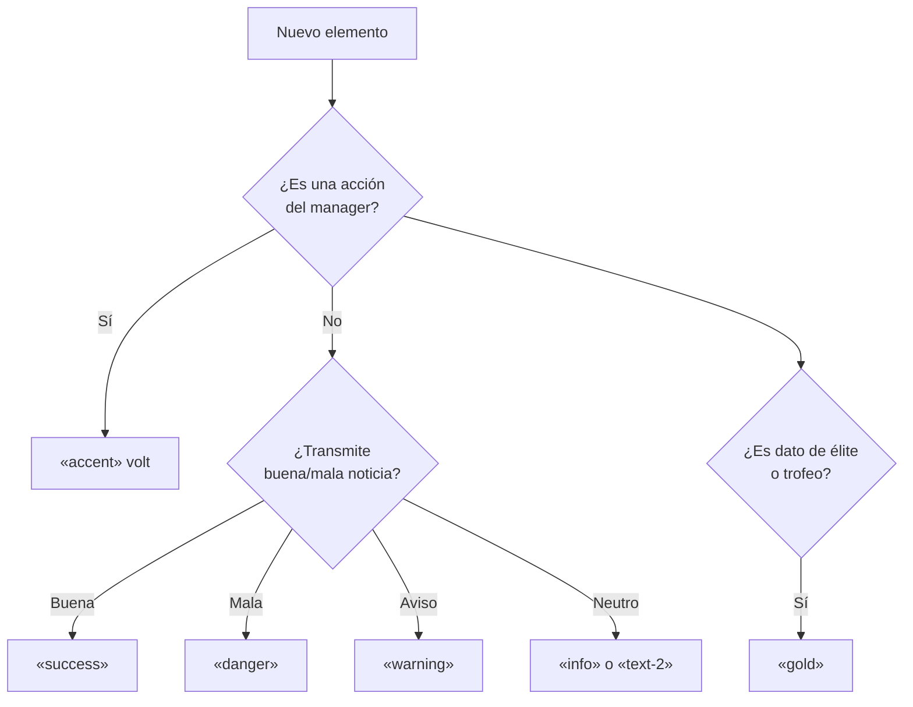
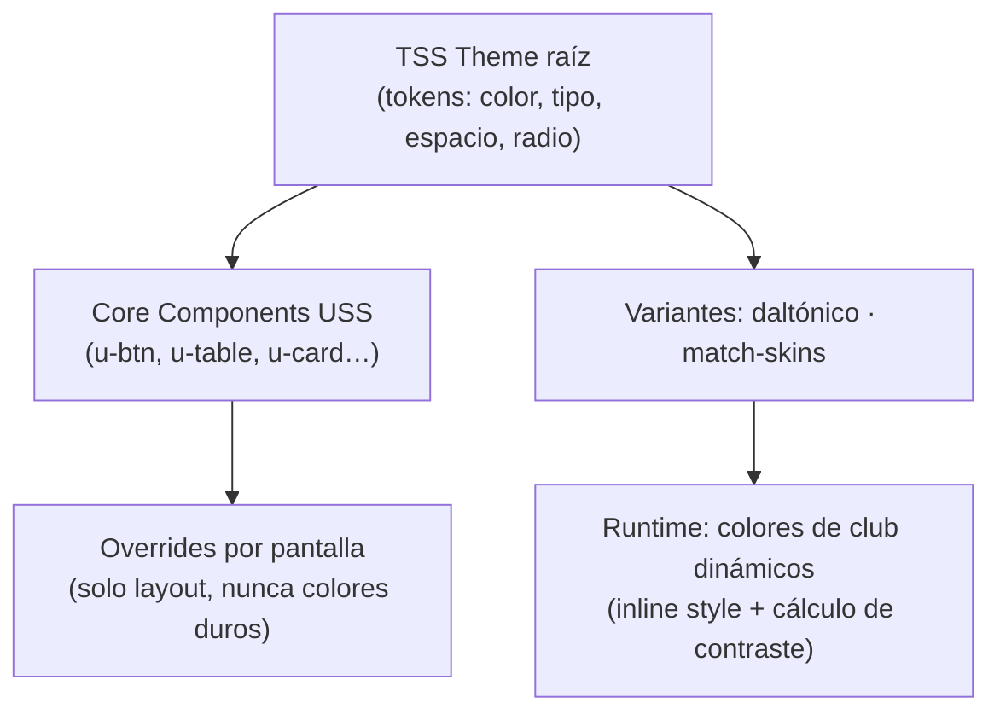

# 🎨 Libro de Estilos — **UniFutsal Manager**
### Documento de identidad visual y diseño de interfaz · v1.0


---

## 1. Identidad de marca

### 1.1 Nombre

**UniFutsal Manager** — *"Uni"* por el mundo entero del futsal en un solo juego (universal, unificado). Siempre se escribe **UniFutsal Manager** (camel case en las tres palabras), nunca "Unifutsal" ni "UFM" en textos de UI (UFM solo como abreviatura técnica en logs/código).

### 1.2 Tagline

| Idioma | Tagline |
| :--- | :--- |
| ES | **«Dirige todo el futsal del mundo.»** |
| EN | *"Run the whole world of futsal."* |

Uso: pantalla de título, splash, stores. Nunca en menús internos.

### 1.3 Logo — concepto y directrices

**Concepto elegido: "La U es la pista".** La letra **U** del wordmark se construye con las líneas de una pista de futsal vista desde arriba: el área central dibuja el círculo central, y un punto-vol (balón) reposa en el interior.

```
Variante principal (horizontal):

  ╭──────────────────────────────╮
  │  U̲ ·─────·                   │   UNIFUTSAL      ← "UNI" en blanco, "FUTSAL" en volt
  │      (pista-U + balón)       │   MANAGER        ← tracking amplio, peso ligero
  ╰──────────────────────────────╯

Variante icono (app/square): cuadrado redondeado fondo «bg-1»,
la U-pista en volt centrada, balón como punto.
```

**Reglas de uso:**
- Fondo oscuro obligatorio para la variante principal (el volt no funciona sobre blanco).
- Zona de respeto = altura de la "U" a cada lado. No rotar, no aplicar degradados, no poner el balón en otro color que volt o blanco.
- El icono de la app es **siempre** la variante cuadrada, nunca el wordmark reducido.

### 1.4 Personalidad de marca (para tomar decisiones cuando este libro no cubre un caso)

> **"Sala nocturna"** — un pabellón de elite a las 21:00: luz LED fría sobre parqué, marcador electrónico, ambiente serio pero eléctrico. Oscura, densa en datos, **precisa**, con un acento energético que marca lo importante. Referencias de tono: FM (densidad), broadcasts de LNFS (seriedad deportiva), estética volt deportiva moderna.

---

## 2. Principios de diseño (5 reglas que deciden cualquier conflicto)

1. **Los datos son la estrella.** Nada decorativo compite con tablas, números y jugadores. El cromo existe para jerarquizar, no para adornar.
2. **Un color = un significado.** El volt es acción primaria; el oro es élite; el verde/rojo/ámbar son semántica pura. Nunca se reciclan.
3. **Densidad con aire.** Filas compactas (30px) pero con respiración estructural: nunca dos niveles de información sin separación visible.
4. **Nunca solo color.** Todo estado (lesión, sanción, forma) lleva icono o texto además del color (accesibilidad, sección 13).
5. **La UI nunca rompe la simulación.** Cero modales que corten el flujo de "Continuar" salvo decisiones irreversibles.

---

## 3. Color

### 3.1 Tema base «Pabellón Nocturno» (único tema en v1.0)

Superficies de oscuro (profundo) a claro (elevado):

| Token | HEX | Uso |
| :--- | :-- | :--- |
| «bg-0» | `#0B1017` | Fondo de app, inputs, match engine |
| «bg-1» | `#101823` | Fondo de pantalla, sidebar |
| «bg-2» | `#182233` | Paneles, tarjetas, cabecera de tabla |
| «bg-3» | `#223049` | Hover, elementos elevados, botones secundarios |
| «border» | `#2A3A55` | Bordes sutiles (1px) |
| «border-strong» | `#3F5578` | Bordes activos, separadores de grupo |

Texto:

| Token | HEX | Uso | Contraste sobre bg-1 |
| :--- | :-- | :--- | :-- |
| «text-1» | `#EAF0F7` | Texto principal, números | ≈ 14:1 ✅ |
| «text-2» | `#A9B6C8` | Texto secundario, labels | ≈ 7:1 ✅ |
| «text-3» | `#6E7D92` | Metadatos, deshabilitado | ≈ 3,5:1 (solo ≥14px o no esencial) |

### 3.2 Acento de marca y semánticos

| Token | HEX | Uso permitido | Uso prohibido |
| :--- | :-- | :--- | :--- |
| «accent» (Volt) | `#B4E33D` | Botón primario, botón **Continuar**, selección activa, foco, minutos clave en texto | Fondos grandes, texto largo, decoración |
| «accent-hover» | `#C9F25C` | Hover de primarios | — |
| «accent-press» | `#8FAD2E` | Pulsado | — |
| «accent-2» (Cian) | `#45C8F1` | Enlaces, datos interactivos secundarios, gráficas serie B | Competir con volt |
| «success» | `#4ADE80` | Positivo: victoria, subida, renovado | — |
| «warning» | `#FBBF24` | Aviso: amarilla, contrato por expirar | — |
| «danger» | `#EF4444` | Negativo: derrota, lesión, roja, despido | — |
| «info» | `#60A5FA` | Informativo neutral | — |
| «gold» (Élite) | `#FFD34D` | Atributos 17-20, trofeos, estrellas | Cualquier otra cosa |

Texto sobre volt = **siempre** «bg-0» (ratio ≈ 12:1). Texto sobre semanticos = «bg-0».

### 3.3 Escala de atributos (1–20, estilo FM)

El estándar visual más reconocible del género. Celdas de tabla y perfil:

| Rango | Token | HEX | Peso | Significado |
| :-- | :--- | :-- | :--- | :--- |
| 1–5 | «text-3» | `#6E7D92` | 400 | Punto débil |
| 6–9 | `#C7D2E0` | — | 400 | Mejorable |
| 10–13 | «text-1» | `#EAF0F7` | 500 | Profesional sólido |
| 14–16 | «success» | `#4ADE80` | 700 | Fortaleza del jugador |
| 17–20 | «gold» | `#FFD34D` | 700 | **Clase mundial** |

Reglas: número entero, siempre alineado al centro en celdas; jamás colorear el fondo de la celda (solo el glifo); en comparador, el mejor de cada fila lleva punto-vol «●» en volt.

### 3.4 Estados dinámicos (barras y chips)

| Estado | Verde | Ámbar | Naranja | Rojo |
| :--- | :-- | :-- | :-- | :-- |
| **Condición física** | ≥85 % «success» | 60–84 «warning» | 40–59 `#FB923C` | <40 «danger» |
| **Moral** | Perfecta/Excelente | Buena/OK | Baja | Fatal |
| **Confianza** (junta/federación/afición) | ≥70 | 40–69 | 15–39 | <15 (riesgo despido) |
| **Forma** | ▲ «success» | ▬ «text-3» | ▼ «danger» | — |

Las barras de progreso usan el color del estado; el resto (track) «bg-0» con borde «border».

### 3.5 Sistema de colores de club (dinámico) ⭐

Cada club define `primary`, `secondary` y patrón opcional (liso/a rayas). Al ser data-driven, cualquier pack/editor puede cambiarlos.

**Reglas de renderizado:**
1. **Contraste automático del texto:** si luminancia de `primary` > 0,55 → texto del badge en «bg-0»; si no, blanco.
2. **Badge de club:** círculo/escudo 16–20px, fondo `primary`, aro 2px `secondary`, iniciales o icono en texto auto-contrastado.
3. **Colisiones en pista (match engine):** si `primary` visitante vs local difieren <25 % en matiz/luminancia, el visitante renderiza con su `secondary` como fondo.
4. **Paleta fallback** (clubes sin color definido — usada también en tests): `#E63946` `#F4A261` `#2A9D8F` `#264653` `#E9C46A` `#9B5DE5` `#F15BB5` `#00BBF9` `#00F5D4` `#FEE440` `#8D99AE` `#EF476F`.

### 3.6 Mapa rápido "¿qué color uso?"



---

## 4. Tipografía

### 4.1 Familias

| Familia | Roles | Cobertura |
| :--- | :--- | :--- |
| **Inter** (variable) | 100 % de la UI, tablas, números | Latín + cirílico ✅ |
| **Noto Sans JP** | Fallback automático solo con locale JA | Japonés |

Carga: Inter subconjuntada por peso (400/500/600/700). **La escala tipográfica multiplicará por el factor de accesibilidad** (1.0 / 1.25 / 1.5 — sección 13).

### 4.2 Escala

| Estilo | Tamaño/Línea | Peso | Uso |
| :--- | :-- | :--- | :--- |
| Display | 32/38 | 700 | Solo pantalla de título y galas de premios |
| H1 | 24/30 | 600 | Título de sección (Plantilla, Finanzas…) |
| H2 | 18/24 | 600 | Título de panel/pestaña |
| H3 | 15/20 | 600 | Cabeceras de tarjeta, nombres de jugador en perfil |
| **Body** | 14/20 | 400 | Texto general, inbox, informes |
| **Tabla densa** | 13/16 | 400–700 | Listas de jugadores, clasificaciones |
| Caption | 12/16 | 500 | Labels de campo, metadatos, unidades |
| Micro | 11/14 | 600 | Badges, cabecera de columna (UPPERCASE + tracking 0.5px) |

### 4.3 Reglas tipográficas

- **Números tabulares siempre en datos** (`font-feature-settings: "tnum"`; Inter lo soporta): tablas, reloj, dinero, estadísticas. Sin esto, las columnas "bailan".
- Dinero: separador de miles según locale; el símbolo va **pegado al final** en ES/IT (`1.234.500 €`) y al principio en US/JP (`$1,234,500`).
- Atributos: entero, sin decimales. Ratings de partido (6,0–10,0): un decimal con coma/punto según locale.
- Nada de texto justificado; máx. 70-75 caracteres por línea en lectura larga (informes).
- Uppercase **solo** en micro-labels y cabeceras de columna. Nunca en botones ni títulos.

---

## 5. Iconografía

| Propiedad | Especificación |
| :--- | :--- |
| Estilo | **Outline**, trazo 1.5px, terminales redondeados, esquinas vivas |
| Rejilla | 24×24 (standard) y 16×16 (in-line en texto/tabla) |
| Set base | **Lucide** (open source) para lo genérico: calendario, dinero, búsqueda, engranaje |
| Set propio (dibujar a juego) | Balón de futsal, pista, silbato, tiempo muerto, power play, doble penalti (punto 10m), chapa/ficha, tarjeta amarilla/roja, portería-jugador |
| Reglas | Un icono = un trazo de grosor constante. Icono + label en navegación; icono solo solo si es universal (guardar, cerrar, play) |

Estados de jugador como badges icono+color: 🩹 Lesionado («danger») · 🟨/🟥 Sancionado · 🚫 No inscrito · 🌍 Convocado NT («info») · ➡️ Cedido · 🕐 Recuperándose («warning»).

---

## 6. Espaciado, rejilla y forma

- **Rejilla base: 4px** (todos los valores múltiples de 4).
- Espaciados estándar: `4 · 8 · 12 · 16 · 24 · 32 · 48`.
- Padding de tarjeta: 16. Padding de fila de tabla: 0 vertical (altura fija).
- **Alturas de fila:** compacta 26 / **estándar 30** / cómoda 36.
- **Radio de borde:** 4px inputs · 6px tarjetas y botones · pill (999) para chips/badges.
- Sombras: solo 2 niveles — `0 2 8 rgba(0,0,0,.35)` (tarjetas elevadas) y `0 8 24 rgba(0,0,0,.5)` (modales). Nada de glow salvo foco.

---

## 7. Anatomía de pantalla y navegación

Toda pantalla de gestión comparte esqueleto:

```
┌──────────────────────────────────────────────────────────────────────┐
│ TOP BAR 48px: [escudo+club] [fecha · temporada] [(finanzas mini)]    │
│                                          [ ⏵ CONTINUAR «accent» ]    │
├────────────┬─────────────────────────────────────────────────────────┤
│ SIDEBAR    │  H1 sección ······························ [acciones ⋯] │
│ 232px      │  Tabs underline ─────────────────────────────────────── │
│ (56px      │  Toolbar: [búsqueda] [filtros ▾] [vista ▾]              │
│ colapsada) │  ┌───────────────────────────────────────────────────┐  │
│            │  │  CONTENIDO (tabla / paneles / pizarra)             │  │
│  grupos ▼  │  │  virtualizado, scroll propio                       │  │
│            │  └───────────────────────────────────────────────────┘  │
│  [Manager] │  Barra de estado opcional (selección, totales)          │
└────────────┴─────────────────────────────────────────────────────────┘
```

**Sidebar — 17 secciones del PRD, agrupadas:**

| Grupo | Entradas |
| :--- | :--- |
| 📥 Hoy | Inbox (con contador no leídos) · Calendario |
| 👥 Mi club | Plantilla · Tácticas · Entrenamiento · Cantera · Reclutamiento · Finanzas · Club · Interacciones |
| 🏆 Juego | Competiciones · Mundo · Día de partido |
| 🎯 Carrera | Manager · Historial · **Selección Nacional** (visible solo si diriges NT) |
| ⚙️ Sistema | Editor · Opciones |

- Item activo: fondo «bg-3» + barra izquierda 3px «accent».
- **Botón Continuar:** el único botón volt fijo en pantalla (top-right, 120×36). Muestra cola de tareas pendientes (badge numérico ámbar) y tooltip con qué desbloquea.
- Paneles internos: navegación por pestañas (no apilar pantallas). Profundidad máxima: 3 niveles antes de exigir cierre explícito.

---

## 8. Biblioteca de componentes

Nomenclatura USS: `u-<bloque>` y `u-<bloque>__<elemento>--<modificador>`.

### 8.1 Inventario

| Componente | Clase | Especificación esencial |
| :--- | :--- | :--- |
| **Botón primario** | `u-btn--primary` | Fondo «accent», texto «bg-0», 600, radio 6, padding 8/16 |
| **Botón secundario** | `u-btn` | Fondo «bg-3», borde «border-strong», texto «text-1» |
| **Botón fantasma** | `u-btn--ghost` | Solo texto «text-2»; hover → «text-1» + fondo «bg-2» |
| **Botón peligro** | `u-btn--danger` | Borde «danger», texto «danger»; confirmación obligatoria |
| **Botón icono** | `u-btn--icon` | 32×32, tooltip obligatorio |
| **Estados** | — | Hover (+brillo 10 %) · Pressed («accent-press») · Disabled (40 % opacidad, sin pointer) · **Foco: anillo 2px «accent» con offset 2px** |
| **Input texto** | `u-input` | Fondo «bg-0», borde «border», focus → borde «accent»; placeholder «text-3» |
| **Dropdown** | `u-select` | Igual que input + chevron; versión con búsqueda para >20 opciones |
| **Slider doble** | `u-range` | Presupuestos: dos tiradores «accent» sobre track «bg-0» |
| **Toggle** | `u-toggle` | Pill 36×20; activo «accent» |
| **Pestañas** | `u-tabs` | Texto «text-2»; activa «text-1» + subrayado 2px «accent»; overflow con chevron |
| **Tabla** | `u-table` | Ver 8.2 |
| **Tarjeta** | `u-card` | Fondo «bg-2», borde «border», radio 6, padding 16; cabecera H3 + acción ⋯ |
| **Chip/estado** | `u-chip` | Pill 20px alto; icono 12 + texto; fondo 15 % del color semántico, texto y borde al 100 % |
| **Barra de progreso** | `u-bar` | 6px alto, track «bg-0», fill con color de estado (3.4), valor a la derecha en tabular |
| **Rating ojo** | `u-eye` | Barra segmentada 10 segmentos; llenos «accent» (los últimos 2 «gold») |
| **Estrellas** | `u-stars` | 0–5 en pasos de ½; «gold»; tamaño 14 |
| **Modal** | `u-modal` | 480–720px, fondo «bg-2», backdrop rgba(0,0,0,.6); ESC cierra salvo irreversible; botones derecha, primario a la derecha |
| **Toast** | `u-toast` | Top-right, apilable (máx 3), 5s, barra lateral de color semántico, cerrable |
| **Tooltip** | `u-tip` | 300ms delay, máx 320px, fondo «bg-3», borde «border-strong»; nunca cortado por viewport |
| **Menú contextual** | `u-menu` | Clic derecho en filas; máx 8 acciones visibles; acciones destructivas al final separadas |
| **Estado vacío** | `u-empty` | Icono 32 «text-3» + frase + CTA. Ej: *"No hay ofertas pendientes. Explora el mercado →"* |
| **Inbox** | `u-inbox` | Lista 320px (no leído: punto «accent» + remitente «text-1») + panel lectura; acciones rápidas inline |

### 8.2 Tabla (el componente rey)

- Cabecera: sticky, fondo «bg-2», Micro uppercase «text-2», ordenable (flecha «accent»), ancho redimensionable.
- Filas: 30px; zebra sutil «bg-1»/«bg-0»; hover «bg-3»; **seleccionada: barra izquierda 3px «accent»**.
- Columnas: texto (izq) · número (der, tabular) · atributo (centro, color 3.3) · jugador (badge+nombre, izq) · chip estado · barra · estrellas.
- Siempre virtualizada; máx ~40 columnas visibles con bloqueo de primera columna (nombre).
- Clic = seleccionar · doble clic = abrir perfil · clic derecho = menú contextual.

---

## 9. Visualización de datos

| Gráfico | Diseño |
| :--- | :--- |
| **Líneas** (finanzas, forma, evolución) | Grid «border» al 50 %, series «accent» y «accent-2», área bajo curva al 10 %, crosshair con tooltip |
| **Barras** (goles/jornada, asistencia pabellón) | «accent»; la barra destacada (récord, actual) «gold» |
| **Radar de atributos** (perfil jugador, opcional v1.1) | Polígono «accent» al 25 %, ejes «text-3», 6 ejes: Técnica · Finalización · Pase · Defensa · Físico · Mental |
| **Mapa de tiros** (análisis post-partido) | Mini-pista «bg-0»; círculos: tamaño = calidad, color = gol «success» / fallo «danger» / parada «info» |
| **Gráficas deshabilitadas si <5 datos** | Mostrar estado vacío, no un gráfico vacío |

**Pizarra táctica:** pista vectorial (ver 10.1), fichas de titulares con **anillo de compatibilidad** (verde/ámbar/rojo), flechas discontinuas «text-2» para rotaciones, zona de pressing como overlay «accent-2» al 15 %.

---

## 10. Match Engine 2D «Chapas»

### 10.1 Pista (40×20 m, vista cenital)

| Skin | Superficie | Líneas | Uso |
| :--- | :--- | :--- | :--- |
| **«Sala»** (default) | `#123B4F` con viñeta radial sutil | `#E6F1F7` al 70 %, 2px | Integra el partido en la UI oscura |
| **«Parqué»** | Tiras de madera `#C88A4E`/`#B97F45`/`#D29559` (gradiente vertical por franjas) | `#22303C`, 2px | Skin clásico "pabellón real" (opción del jugador) |

Elementos reglamentarios siempre visibles: círculo central, áreas de 6m, **puntos de doble penalti a 10m** (punto «gold» cuando es tiro sin barrera), arcos de esquina, marcas de zona de cambios en la banda superior, banquillos dibujados fuera de pista.

### 10.2 Fichas («chapas») y balón

| Elemento | Especificación |
| :--- | :--- |
| Ficha | Círculo 22px (zoom 0.8×–1.5×): relleno `primary` del club, **aro 2px `secondary`**, contorno exterior 1px «bg-0» (legibilidad sobre pista), dorsal en texto auto-contrastado |
| Portero | Igual + icono guante 10px bajo el dorsal |
| Etiqueta | Apellido 11px bajo la ficha («text-1» con sombra 1px), activable |
| Portador del balón | Anillo blanco pulsante (2px, 1.2s loop) |
| Ficha seleccionada/instruida | Anillo discontinuo «accent» |
| Balón | Círculo 8px blanco, borde 1px «bg-0», estela de 3 posiciones fantasma al 20/35/50 % de opacidad, sombra elíptica sutil |
| Inferioridad 5v4 | Contador "−1" chip «danger» junto al marcador del equipo |

### 10.3 HUD del partido

```
        ┌───────────── marcador superior centrado ─────────────┐
        │ [badge] INTER  2 — 1  BARÇA [badge]   1ª · 14:32     │
        │ Faltas: ●●●●● (doble penalti)   ·   ●●○○○            │
        └───────────────────────────────────────────────────────┘
  [⏸] [▶×1] [▶×2] [▶×8]   [Solo momentos clave ▾]   [Táctica] [Cambios] [⏱ Tiempo muerto]
  ───────────────── ticker de narración (último evento) ─────────────────
```

- Reloj: cuenta **atrás** 20:00→0:00 por periodo (regla futsal), tabular, 600.
- Faltas acumuladas: 5 puntos por periodo; vacíos «border», llenos «warning»; al 5º → chip «danger» "DOBLE PENALTI".
- Eventos: banner de **GOL** (franja «accent» 1.2s con autor y minuto) · **roja** (chip «danger») · **tiempo muerto** (overlay con pizarra) · **doble penalti** (zoom suave al punto 10m + marcador «gold»).
- El HUD ocupa **máx. 20 %** de la altura: la pista es la protagonista.

### 10.4 Modo texto

Feed cronológico estilo FM: `MIN` en tabular «accent» + descripción «text-1» + contexto «text-2». Eventos importantes (gol, doble penalti, roja, lesión) en fila con fondo semántico al 12 % + icono. Filtros chip arriba: `Todos · Goles · Ocasiones · Faltas · Cambios`. Auto-scroll con pausa al pasar el ratón. Controles de velocidad idénticos al 2D (**misma simulación, otro presentador**).

---

## 11. Motion

| Interacción | Duración | Easing |
| :--- | :-- | :--- |
| Hover/estado | 120 ms | ease-out |
| Transición entre pantallas | 150 ms fade | ease-out |
| Aparición de paneles/modales | 200–250 ms | scale 0.98→1 + fade |
| Toasts | 250 ms in · 200 ms out | ease-out |
| Banner de gol | 1.200 ms | slide-in 100ms, hold 800ms, fade 300ms |
| Física del match engine | Tiempo real según velocidad ×1/×2/×8 | — |

Reglas: nunca bloquear input con animaciones >300 ms; **opción "Reducir animaciones"** sustituye banners por chips inline; las transiciones no reordenan contenido (evitar layout shift).

---

## 12. Voz y estilo de escritura

### 12.1 Tono

Periodista deportivo sobrio: **claro, directo, profesional**. Trata al manager de "tú". Sin humor forzado, sin exclamaciones múltiples, sin jerga anglicista innecesaria (usar "tiempo muerto", no "timeout"; "doble penalti", no "doble penalty" salvo locale EN).

### 12.2 Reglas de copy

| Contexto | Regla | Ejemplo |
| :--- | :--- | :--- |
| Botones | Verbo + objeto, sin artículo | "Guardar táctica" · "Renovar contrato" |
| Títulos | Primera palabra en mayúscula, resto normal (ES) | "Oferta recibida por Vilela" |
| Vacíos | Estado + acción | "Sin informes aún. Asigna un ojeador →" |
| Errores | Causa + solución, nunca culpabilizar | "No puedes inscribir 19 jugadores: el máximo es 18." |
| Noticias/prensa | Estilo crónica: dato + cita + contexto | "El Inter se impone en el derbi (3-1) con doblete de Solano." |
| Números en texto | Cifras <10 en palabra en narrativa; siempre dígito en datos | "tres cambios" / "Ratings: 7,4" |

### 12.3 Glosario futsal (capitalización fija para i18n)

**Doble Penalti · Power Play · Portero-Jugador · Tiempo Muerto · Faltas Acumuladas · Pívot · Cierre · Ala · Universal · Segunda División B (2ªB) · Youth Intake → "Captación"**. Los nombres de sistemas tácticos en minúscula: *3-1, 2-2, rombo, 4-0*.

---

## 13. Accesibilidad

| Requisito | Especificación |
| :--- | :--- |
| Contraste | WCAG AA (4.5:1 texto normal; 3:1 grande ≥18px/600). Los tokens de la sección 3 ya cumplen; **cualquier color nuevo debe validarse** |
| Color no exclusivo | Todo estado lleva icono/texto (sección 8.1 chips). Las barras llevan % numérico |
| **Modo daltónico** | Intercambia «success»/«danger» por `#3BA3FF`/`#FF8A3D` + refuerza iconos ▲▼; activable en Opciones |
| Escala de fuente | 100 % / 125 % / 150 % (multiplicador global de la escala 4.2; las tablas ganan altura de fila automáticamente: 30→36→42) |
| Teclado | Navegación completa: `Espacio` = Continuar · `F` = foco en búsqueda · `Tab/Shift-Tab` cíclico · `Esc` cierra modal/menú · anillo de foco siempre visible |
| Objetos de clic | Mínimo 28×28px (juego de ratón; 32px recomendado) |
| Animaciones | Toggle "Reducir animaciones" (sección 11) |

---

## 14. Implementación técnica (Unity UI Toolkit)

### 14.1 Arquitectura de temas



### 14.2 Tokens USS (extracto canónico)

```css
:root {
  /* Superficies */
  --color-bg-0: rgb(11, 16, 23);
  --color-bg-1: rgb(16, 24, 35);
  --color-bg-2: rgb(24, 34, 51);
  --color-bg-3: rgb(34, 48, 73);
  --color-border: rgb(42, 58, 85);
  --color-border-strong: rgb(63, 85, 120);

  /* Texto */
  --color-text-1: rgb(234, 240, 247);
  --color-text-2: rgb(169, 182, 200);
  --color-text-3: rgb(110, 125, 146);

  /* Marca y semántica */
  --color-accent: rgb(180, 227, 61);
  --color-accent-hover: rgb(201, 242, 92);
  --color-accent-press: rgb(143, 173, 46);
  --color-accent-2: rgb(69, 200, 241);
  --color-success: rgb(74, 222, 128);
  --color-warning: rgb(251, 191, 36);
  --color-danger: rgb(239, 68, 68);
  --color-info: rgb(96, 165, 250);
  --color-gold: rgb(255, 211, 77);

  /* Tipografía */
  --font-main: "Inter", "Noto Sans JP";
  --fs-body: 14px;  --fs-table: 13px;  --fs-caption: 12px;  --fs-micro: 11px;
  --fs-h3: 15px;    --fs-h2: 18px;     --fs-h1: 24px;       --fs-display: 32px;
  --ui-scale: 1;             /* accesibilidad: 1 / 1.25 / 1.5 */

  /* Espacio y forma */
  --sp-1: 4px; --sp-2: 8px; --sp-3: 12px; --sp-4: 16px;
  --sp-6: 24px; --sp-8: 32px; --sp-12: 48px;
  --radius-s: 4px; --radius-m: 6px;
  --row-h: 30px;

  /* Elevación */
  --shadow-1: 0 2 8 0 rgba(0,0,0,0.35);
  --shadow-2: 0 8 24 0 rgba(0,0,0,0.5);
}
```

### 14.3 Ejemplo de componente (referencia de patrón)

```css
.u-btn--primary {
  background-color: var(--color-accent);
  color: var(--color-bg-0);
  border-radius: var(--radius-m);
  padding: var(--sp-2) var(--sp-4);
  -unity-font-style: bold;
  transition-duration: 120ms;
}
.u-btn--primary:hover { background-color: var(--color-accent-hover); }
.u-btn--primary:active { background-color: var(--color-accent-press); }
.u-btn--primary:focus { border-color: var(--color-accent); border-width: 2px; }
.u-btn--primary:disabled { opacity: 0.4; }
```

### 14.4 Reglas de implementación

1. **Prohibido hexadecimal fuera del theme raíz** y fuera del sistema de colores de club (3.5). Code review lo valida.
2. Iconos: SVG importados como vector (Unity 6 `IconSpecifier`) o PNG @1x/@2x/@3x; nunca estirados.
3. Colores de club: calculados en runtime (`style.backgroundColor` + luminancia para texto); badges cacheados en RenderTexture 256px.
4. Listas siempre con `ListView` virtualizado con reuso; jamás `ScrollView` con hijos dinámicos.
5. Cada pantalla nueva debe registrar sus UXML en el índice del tutorial contextual (los tooltips del glosario 12.3 se enlazan por clave, no por texto).

---

## 15. Checklist de cumplimiento (para cerrar cualquier pantalla)

- [ ] Usa solo tokens (0 hex sueltos) y componentes de la biblioteca 8.1.
- [ ] Números en tabular · atributos según escala 3.3 · estados con icono+color.
- [ ] Filas 30px, zebra, selección con barra volt, clic derecho con menú contextual.
- [ ] Estado vacío con CTA · errores con causa+solución · nada de "¡Ups!".
- [ ] Foco visible por teclado y orden de tabulador coherente.
- [ ] Contrast AA verificado en los dos temas de pista/skin si aplica.
- [ ] Nada de animación >300ms bloqueante; respeta "Reducir animaciones".
- [ ] Textos extraídos a i18n (0 cadenas hardcodeadas) y glosario 12.3 respetado.
- [ ] Botón **Continuar** accesible desde esta pantalla sin scroll.

---

