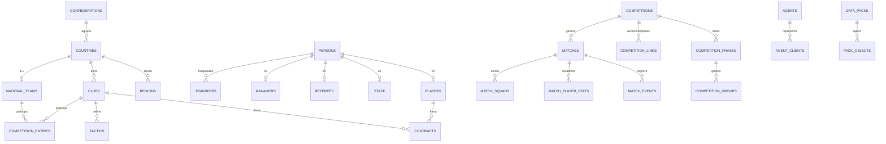
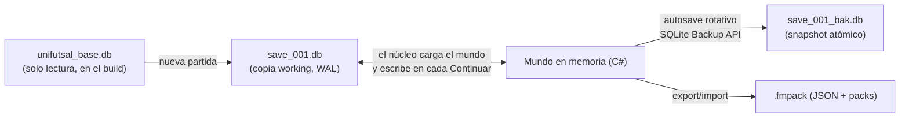

# 🗄️ Modelo de Datos SQLite — **UniFutsal Manager**
### Documento técnico · v1.0.1 **(completo)** · Desbloquea el hito M1 (Núcleo)

> **v1.0.1 — Changelog:** completa los dominios **D5–D12** (el corte anterior se produjo en `match_events`) · refinamientos en `matches` (`referee_id`, `tie_key`, `leg`) · nueva tabla `match_squads` · sección de **estrategia de persistencia** que resuelve la relación BD base ↔ partida ↔ save · mapeo CSV (RF-910) · queries de validación del mundo para QA de M2.

---

## 1. Diagrama de alto nivel



---

## 2. Convenciones

| Regla | Decisión |
| :--- | :--- |
| Nombres | `snake_case`, tablas en plural, sin acentos/ñ en identificadores |
| PK | `INTEGER PRIMARY KEY` (rowid) interno; **`uid TEXT UNIQUE`** como identidad estable para round-trip de packs |
| FKs | `PRAGMA foreign_keys = ON`; **se activa tras ejecutar el DDL completo** (permite referencias a tablas definidas después, p. ej. `competitions` → `data_packs`) |
| Enums | `TEXT` con `CHECK (x IN (...))` |
| Dinero | `INTEGER` euros |
| Fechas | `TEXT` ISO-8601; reloj de partido en `clock_mm`/`clock_ss` (reloj parado) |
| Booleanos | `INTEGER 0/1` |
| JSON | Columnas `*_json` con schemas documentados en §8 del PRD y §5.2 |
| Archivo | `unifutsal_base.db` (solo lectura, incluido en el build) — ver estrategia §7 |

---

## 3. Script de inicialización

```sql
PRAGMA journal_mode = WAL;
PRAGMA user_version = 1;              -- versión del schema
-- PRAGMA foreign_keys = ON;  ← se activa AL FINAL del script, antes de insertar datos

CREATE TABLE meta (
  key   TEXT PRIMARY KEY,
  value TEXT NOT NULL
);
-- seed: ('schema_version','1') · ('world_seed','...') · ('world_date','2026-07-01')
--        ('game_version','0.1.0') · ('locale_default','es')
```

---

## 4. DDL por dominios

### D1 · Geografía y configuración base

```sql
CREATE TABLE confederations (
  id   INTEGER PRIMARY KEY,
  code TEXT NOT NULL UNIQUE,          -- UEFA | CONMEBOL | CONCACAF | CAF | AFC | OFC
  name TEXT NOT NULL
);

CREATE TABLE countries (
  id                 INTEGER PRIMARY KEY,
  uid                TEXT NOT NULL UNIQUE,
  name               TEXT NOT NULL,
  code3              TEXT NOT NULL UNIQUE,      -- ESP, BRA, KAZ...
  confederation_id   INTEGER NOT NULL REFERENCES confederations(id),
  futsal_reputation  REAL NOT NULL DEFAULT 50   -- 0-100
);

CREATE TABLE regions (                -- ojeo y captación (RF-501, RF-406)
  id            INTEGER PRIMARY KEY,
  country_id    INTEGER NOT NULL REFERENCES countries(id),
  name          TEXT NOT NULL,
  youth_quality REAL NOT NULL DEFAULT 50
);

CREATE TABLE venues (                 -- pabellones
  id         INTEGER PRIMARY KEY,
  uid        TEXT NOT NULL UNIQUE,
  name       TEXT NOT NULL,
  city       TEXT,
  country_id INTEGER REFERENCES countries(id),
  capacity   INTEGER NOT NULL DEFAULT 1500 CHECK (capacity BETWEEN 100 AND 60000),
  surface    TEXT NOT NULL DEFAULT 'parquet'
             CHECK (surface IN ('parquet','linoleum','pvc','taraflex'))
);
```

### D2 · Personas, jugadores, staff, agentes

```sql
CREATE TABLE persons (
  id                    INTEGER PRIMARY KEY,
  uid                   TEXT NOT NULL UNIQUE,
  first_name            TEXT NOT NULL,
  last_name             TEXT NOT NULL,
  common_name           TEXT,                   -- "Kike", "Falcão"
  gender                TEXT NOT NULL DEFAULT 'M' CHECK (gender IN ('M','F')),
  birth_date            TEXT NOT NULL,
  birth_city            TEXT,
  birth_country_id      INTEGER REFERENCES countries(id),
  nationality_id        INTEGER NOT NULL REFERENCES countries(id),
  second_nationality_id INTEGER REFERENCES countries(id),
  height_cm             INTEGER CHECK (height_cm BETWEEN 150 AND 220),
  weight_kg             INTEGER,
  personality_key       TEXT,
  source                TEXT NOT NULL DEFAULT 'seed'
                        CHECK (source IN ('seed','import','generated','youth'))
);

CREATE TABLE traits (                 -- rasgos aprendibles (RF-402)
  id          INTEGER PRIMARY KEY,
  key         TEXT NOT NULL UNIQUE,
  name_key    TEXT NOT NULL,
  category    TEXT NOT NULL CHECK (category IN ('tecnica','mental','fisica','portero')),
  effect_json TEXT NOT NULL DEFAULT '{}'
);

CREATE TABLE player_traits (
  player_id  INTEGER NOT NULL REFERENCES persons(id) ON DELETE CASCADE,
  trait_id   INTEGER NOT NULL REFERENCES traits(id),
  learned_on TEXT NOT NULL,
  PRIMARY KEY (player_id, trait_id)
) WITHOUT ROWID;

CREATE TABLE agents (                 -- simplificado estilo FM26 (RF-504)
  id             INTEGER PRIMARY KEY,
  person_id      INTEGER UNIQUE REFERENCES persons(id),
  agency_name    TEXT,
  reputation     REAL NOT NULL DEFAULT 40,
  commission_pct REAL NOT NULL DEFAULT 5 CHECK (commission_pct BETWEEN 0 AND 15)
);

CREATE TABLE agent_clients (
  agent_id  INTEGER NOT NULL REFERENCES agents(id) ON DELETE CASCADE,
  player_id INTEGER NOT NULL REFERENCES persons(id),
  since     TEXT NOT NULL,
  PRIMARY KEY (agent_id, player_id)
) WITHOUT ROWID;
```

**Catálogo de atributos (42 columnas en `players`):**

| Grupo | Columnas |
| :--- | :--- |
| **Técnicos (11)** | `t_control` · `t_conduccion` · `t_pase` · `t_pase_un_toque` · `t_finalizacion` · `t_tiro_lejano` · `t_regate` · `t_poste` (juego de espaldas) · `t_entrada` · `t_intercepcion` · `t_bloqueo` |
| **Portero (8)** | `g_paradas` · `g_reflejos` · `g_uno_con_uno` · `g_juego_pies` · `g_distribucion` · `g_posicionamiento` · `g_salidas` · `g_jugador` (como jugador de campo) |
| **Mentales (11)** | `m_vision` · `m_decision` · `m_anticipacion` · `m_concentracion` · `m_posicionamiento` · `m_agresividad` · `m_serenidad` · `m_liderazgo` · `m_equipo` · `m_trabajo` · `m_arrojo` |
| **Físicos (8)** | `p_aceleracion` · `p_velocidad` · `p_agilidad` · `p_equilibrio` · `p_coordinacion` · `p_resistencia` · `p_fuerza` · `p_salto` |
| **Ocultos (4)** | `h_consistencia` · `h_lesiones` · `h_juego_duro` (alimenta faltas acumuladas) · `h_temperamento` |

Todos `INTEGER 1–20`. `current_ability` (CA) y `potential_ability` (PA) en escala 1–200; **CA es derivado** mediante `positional_weights` (data-driven).

```sql
CREATE TABLE players (
  person_id           INTEGER PRIMARY KEY REFERENCES persons(id) ON DELETE CASCADE,
  position_main       TEXT NOT NULL CHECK (position_main IN ('POR','CIE','ALI','ALD','PIV','UNI')),
  position_secondary  TEXT    CHECK (position_secondary IN ('POR','CIE','ALI','ALD','PIV','UNI')),
  preferred_foot      TEXT NOT NULL DEFAULT 'D' CHECK (preferred_foot IN ('D','I','AM')),
  weak_foot           INTEGER NOT NULL DEFAULT 3 CHECK (weak_foot BETWEEN 1 AND 5),
  current_ability     INTEGER NOT NULL CHECK (current_ability BETWEEN 1 AND 200),
  potential_ability   INTEGER NOT NULL CHECK (potential_ability BETWEEN 1 AND 200),
  -- Técnicos (11)
  t_control INTEGER NOT NULL DEFAULT 10 CHECK (t_control BETWEEN 1 AND 20),
  t_conduccion INTEGER NOT NULL DEFAULT 10 CHECK (t_conduccion BETWEEN 1 AND 20),
  t_pase INTEGER NOT NULL DEFAULT 10 CHECK (t_pase BETWEEN 1 AND 20),
  t_pase_un_toque INTEGER NOT NULL DEFAULT 10 CHECK (t_pase_un_toque BETWEEN 1 AND 20),
  t_finalizacion INTEGER NOT NULL DEFAULT 10 CHECK (t_finalizacion BETWEEN 1 AND 20),
  t_tiro_lejano INTEGER NOT NULL DEFAULT 10 CHECK (t_tiro_lejano BETWEEN 1 AND 20),
  t_regate INTEGER NOT NULL DEFAULT 10 CHECK (t_regate BETWEEN 1 AND 20),
  t_poste INTEGER NOT NULL DEFAULT 10 CHECK (t_poste BETWEEN 1 AND 20),
  t_entrada INTEGER NOT NULL DEFAULT 10 CHECK (t_entrada BETWEEN 1 AND 20),
  t_intercepcion INTEGER NOT NULL DEFAULT 10 CHECK (t_intercepcion BETWEEN 1 AND 20),
  t_bloqueo INTEGER NOT NULL DEFAULT 10 CHECK (t_bloqueo BETWEEN 1 AND 20),
  -- Portero (8) — default 1 (no portero)
  g_paradas INTEGER NOT NULL DEFAULT 1 CHECK (g_paradas BETWEEN 1 AND 20),
  g_reflejos INTEGER NOT NULL DEFAULT 1 CHECK (g_reflejos BETWEEN 1 AND 20),
  g_uno_con_uno INTEGER NOT NULL DEFAULT 1 CHECK (g_uno_con_uno BETWEEN 1 AND 20),
  g_juego_pies INTEGER NOT NULL DEFAULT 1 CHECK (g_juego_pies BETWEEN 1 AND 20),
  g_distribucion INTEGER NOT NULL DEFAULT 1 CHECK (g_distribucion BETWEEN 1 AND 20),
  g_posicionamiento INTEGER NOT NULL DEFAULT 1 CHECK (g_posicionamiento BETWEEN 1 AND 20),
  g_salidas INTEGER NOT NULL DEFAULT 1 CHECK (g_salidas BETWEEN 1 AND 20),
  g_jugador INTEGER NOT NULL DEFAULT 1 CHECK (g_jugador BETWEEN 1 AND 20),
  -- Mentales (11)
  m_vision INTEGER NOT NULL DEFAULT 10 CHECK (m_vision BETWEEN 1 AND 20),
  m_decision INTEGER NOT NULL DEFAULT 10 CHECK (m_decision BETWEEN 1 AND 20),
  m_anticipacion INTEGER NOT NULL DEFAULT 10 CHECK (m_anticipacion BETWEEN 1 AND 20),
  m_concentracion INTEGER NOT NULL DEFAULT 10 CHECK (m_concentracion BETWEEN 1 AND 20),
  m_posicionamiento INTEGER NOT NULL DEFAULT 10 CHECK (m_posicionamiento BETWEEN 1 AND 20),
  m_agresividad INTEGER NOT NULL DEFAULT 10 CHECK (m_agresividad BETWEEN 1 AND 20),
  m_serenidad INTEGER NOT NULL DEFAULT 10 CHECK (m_serenidad BETWEEN 1 AND 20),
  m_liderazgo INTEGER NOT NULL DEFAULT 10 CHECK (m_liderazgo BETWEEN 1 AND 20),
  m_equipo INTEGER NOT NULL DEFAULT 10 CHECK (m_equipo BETWEEN 1 AND 20),
  m_trabajo INTEGER NOT NULL DEFAULT 10 CHECK (m_trabajo BETWEEN 1 AND 20),
  m_arrojo INTEGER NOT NULL DEFAULT 10 CHECK (m_arrojo BETWEEN 1 AND 20),
  -- Físicos (8)
  p_aceleracion INTEGER NOT NULL DEFAULT 10 CHECK (p_aceleracion BETWEEN 1 AND 20),
  p_velocidad INTEGER NOT NULL DEFAULT 10 CHECK (p_velocidad BETWEEN 1 AND 20),
  p_agilidad INTEGER NOT NULL DEFAULT 10 CHECK (p_agilidad BETWEEN 1 AND 20),
  p_equilibrio INTEGER NOT NULL DEFAULT 10 CHECK (p_equilibrio BETWEEN 1 AND 20),
  p_coordinacion INTEGER NOT NULL DEFAULT 10 CHECK (p_coordinacion BETWEEN 1 AND 20),
  p_resistencia INTEGER NOT NULL DEFAULT 10 CHECK (p_resistencia BETWEEN 1 AND 20),
  p_fuerza INTEGER NOT NULL DEFAULT 10 CHECK (p_fuerza BETWEEN 1 AND 20),
  p_salto INTEGER NOT NULL DEFAULT 10 CHECK (p_salto BETWEEN 1 AND 20),
  -- Ocultos (4)
  h_consistencia INTEGER NOT NULL DEFAULT 10 CHECK (h_consistencia BETWEEN 1 AND 20),
  h_lesiones INTEGER NOT NULL DEFAULT 10 CHECK (h_lesiones BETWEEN 1 AND 20),
  h_juego_duro INTEGER NOT NULL DEFAULT 10 CHECK (h_juego_duro BETWEEN 1 AND 20),
  h_temperamento INTEGER NOT NULL DEFAULT 10 CHECK (h_temperamento BETWEEN 1 AND 20),
  retired INTEGER NOT NULL DEFAULT 0
);

CREATE TABLE positional_weights (     -- pesos de CA por posición (editable en editor)
  position  TEXT NOT NULL CHECK (position IN ('POR','CIE','ALI','ALD','PIV','UNI')),
  attribute TEXT NOT NULL,
  weight    REAL NOT NULL DEFAULT 0,
  PRIMARY KEY (position, attribute)
) WITHOUT ROWID;

CREATE TABLE staff (
  person_id        INTEGER PRIMARY KEY REFERENCES persons(id) ON DELETE CASCADE,
  role             TEXT NOT NULL CHECK (role IN
                     ('entrenador','segundo','prep_porteros','prep_fisico','fisioterapeuta',
                      'psicologo','ojeador','analista','director_deportivo','medico')),
  ent_tecnica INTEGER NOT NULL DEFAULT 10 CHECK (ent_tecnica BETWEEN 1 AND 20),
  ent_ofensiva INTEGER NOT NULL DEFAULT 10 CHECK (ent_ofensiva BETWEEN 1 AND 20),
  ent_defensiva INTEGER NOT NULL DEFAULT 10 CHECK (ent_defensiva BETWEEN 1 AND 20),
  ent_porteros INTEGER NOT NULL DEFAULT 10 CHECK (ent_porteros BETWEEN 1 AND 20),
  ent_fisica INTEGER NOT NULL DEFAULT 10 CHECK (ent_fisica BETWEEN 1 AND 20),
  ent_tactica INTEGER NOT NULL DEFAULT 10 CHECK (ent_tactica BETWEEN 1 AND 20),
  medicina INTEGER NOT NULL DEFAULT 10 CHECK (medicina BETWEEN 1 AND 20),
  h_juicio_habilidad INTEGER NOT NULL DEFAULT 10 CHECK (h_juicio_habilidad BETWEEN 1 AND 20),
  h_juicio_potencial INTEGER NOT NULL DEFAULT 10 CHECK (h_juicio_potencial BETWEEN 1 AND 20),
  motivacion INTEGER NOT NULL DEFAULT 10 CHECK (motivacion BETWEEN 1 AND 20),
  gestion_vestuario INTEGER NOT NULL DEFAULT 10 CHECK (gestion_vestuario BETWEEN 1 AND 20),
  negociacion INTEGER NOT NULL DEFAULT 10 CHECK (negociacion BETWEEN 1 AND 20),
  adaptabilidad INTEGER NOT NULL DEFAULT 10 CHECK (adaptabilidad BETWEEN 1 AND 20),
  retired INTEGER NOT NULL DEFAULT 0
);

CREATE TABLE referees (
  person_id        INTEGER PRIMARY KEY REFERENCES persons(id) ON DELETE CASCADE,
  country_id       INTEGER REFERENCES countries(id),
  strictness       INTEGER NOT NULL DEFAULT 10 CHECK (strictness BETWEEN 1 AND 20),
  big_match_rating REAL NOT NULL DEFAULT 50
);
```

### D3 · Clubes, finanzas

```sql
CREATE TABLE clubs (
  id                  INTEGER PRIMARY KEY,
  uid                 TEXT NOT NULL UNIQUE,
  name                TEXT NOT NULL,
  short_name          TEXT,
  nickname            TEXT,
  country_id          INTEGER NOT NULL REFERENCES countries(id),
  region_id           INTEGER REFERENCES regions(id),
  city                TEXT,
  founded_year        INTEGER,
  primary_color       TEXT NOT NULL DEFAULT '#E63946'
                      CHECK (length(primary_color) = 7 AND primary_color GLOB '#[0-9a-fA-F]*'),
  secondary_color     TEXT NOT NULL DEFAULT '#FFFFFF'
                      CHECK (length(secondary_color) = 7 AND secondary_color GLOB '#[0-9a-fA-F]*'),
  kit_pattern         TEXT NOT NULL DEFAULT 'solid'
                      CHECK (kit_pattern IN ('solid','stripes','halved','sash')),
  reputation          REAL NOT NULL DEFAULT 40,
  venue_id            INTEGER REFERENCES venues(id),
  training_facilities INTEGER NOT NULL DEFAULT 10 CHECK (training_facilities BETWEEN 1 AND 20),
  youth_facilities    INTEGER NOT NULL DEFAULT 10 CHECK (youth_facilities BETWEEN 1 AND 20),
  recruitment         INTEGER NOT NULL DEFAULT 10 CHECK (recruitment BETWEEN 1 AND 20),
  physio_rating       INTEGER NOT NULL DEFAULT 10 CHECK (physio_rating BETWEEN 1 AND 20),
  bank_balance        INTEGER NOT NULL DEFAULT 0,
  debt                INTEGER NOT NULL DEFAULT 0,
  transfer_budget     INTEGER NOT NULL DEFAULT 0,
  wage_budget_monthly INTEGER NOT NULL DEFAULT 0,
  is_active           INTEGER NOT NULL DEFAULT 1
);

CREATE TABLE club_objectives (        -- objetivos de la junta por temporada (RF-209)
  id          INTEGER PRIMARY KEY,
  season_id   INTEGER NOT NULL REFERENCES seasons(id),
  club_id     INTEGER NOT NULL REFERENCES clubs(id) ON DELETE CASCADE,
  objective   TEXT NOT NULL CHECK (objective IN
                ('posicion_liga','campeon_copa','ucl_fase','ucl_final4','permanencia',
                 'no_descenso_admin','balance_positivo','promocion_cantera')),
  target      TEXT,
  priority    TEXT NOT NULL CHECK (priority IN ('obligatorio','importante','deseable')),
  reward_json TEXT
);

CREATE TABLE club_finances_monthly (  -- snapshot para gráficas
  id          INTEGER PRIMARY KEY,
  club_id     INTEGER NOT NULL REFERENCES clubs(id) ON DELETE CASCADE,
  month       TEXT NOT NULL,          -- '2027-03'
  income      INTEGER NOT NULL DEFAULT 0,
  expenses    INTEGER NOT NULL DEFAULT 0,
  balance_end INTEGER NOT NULL DEFAULT 0,
  UNIQUE (club_id, month)
);

CREATE TABLE financial_transactions (
  id          INTEGER PRIMARY KEY,
  club_id     INTEGER NOT NULL REFERENCES clubs(id) ON DELETE CASCADE,
  date        TEXT NOT NULL,
  category    TEXT NOT NULL CHECK (category IN
                ('premio','taquilla','abonos','patrocinio','tv','fichaje_in','fichaje_out',
                 'salarios','viajes','agente','instalaciones','cantera','multa','amistoso','otro')),
  amount      INTEGER NOT NULL,
  description TEXT,
  match_id    INTEGER REFERENCES matches(id),
  transfer_id INTEGER REFERENCES transfers(id)
);
```

### D4 · Competiciones (núcleo data-driven) ⭐

```sql
CREATE TABLE seasons (
  id         INTEGER PRIMARY KEY,
  label      TEXT NOT NULL UNIQUE,    -- '2026/27' o '2027'
  start_date TEXT NOT NULL,
  end_date   TEXT NOT NULL
);

CREATE TABLE competitions (
  id                INTEGER PRIMARY KEY,
  uid               TEXT NOT NULL UNIQUE,
  name              TEXT NOT NULL,
  short_name        TEXT,
  scope             TEXT NOT NULL CHECK (scope IN ('club','seleccion')),
  type              TEXT NOT NULL CHECK (type IN ('liga','copa')),
  country_id        INTEGER REFERENCES countries(id),          -- NULL = internacional
  confederation_id  INTEGER REFERENCES confederations(id),
  level             INTEGER,
  prestige          REAL NOT NULL DEFAULT 30,
  rules_json        TEXT NOT NULL DEFAULT '{}',   -- inscripción, disciplina, premios, desempates
  active            INTEGER NOT NULL DEFAULT 1,
  source_pack_id    INTEGER REFERENCES data_packs(id)        -- tabla definida en D11
);

CREATE TABLE competition_phases (
  id             INTEGER PRIMARY KEY,
  competition_id INTEGER NOT NULL REFERENCES competitions(id) ON DELETE CASCADE,
  phase_index    INTEGER NOT NULL,
  name           TEXT,
  format         TEXT NOT NULL CHECK (format IN
                   ('round_robin','knockout','mini_torneo','final_four')),
  teams_in       INTEGER,
  teams_out      INTEGER,
  config_json    TEXT NOT NULL DEFAULT '{}',
  UNIQUE (competition_id, phase_index)
);

CREATE TABLE competition_groups (
  id            INTEGER PRIMARY KEY,
  phase_id      INTEGER NOT NULL REFERENCES competition_phases(id) ON DELETE CASCADE,
  name          TEXT NOT NULL,
  group_index   INTEGER NOT NULL,
  host_venue_id INTEGER REFERENCES venues(id)      -- sede de mini-torneo UCL
);

CREATE TABLE competition_links (  -- ascensos, descensos, plazas UCL, clasificatorios NT
  id                  INTEGER PRIMARY KEY,
  from_competition_id INTEGER NOT NULL REFERENCES competitions(id) ON DELETE CASCADE,
  to_competition_id   INTEGER REFERENCES competitions(id),
  link_type           TEXT NOT NULL CHECK (link_type IN
                        ('ascenso','descenso','clasificacion','repesca','baja')),
  criteria_json       TEXT NOT NULL,
  slots               INTEGER NOT NULL DEFAULT 1,
  priority            INTEGER NOT NULL DEFAULT 10
);

CREATE TABLE competition_entries (
  id                    INTEGER PRIMARY KEY,
  season_id             INTEGER NOT NULL REFERENCES seasons(id),
  competition_id        INTEGER NOT NULL REFERENCES competitions(id),
  club_id               INTEGER REFERENCES clubs(id),
  national_team_id      INTEGER REFERENCES national_teams(id),
  group_id              INTEGER REFERENCES competition_groups(id),
  seed                  INTEGER,
  qualified_via_link_id INTEGER REFERENCES competition_links(id),
  status                TEXT NOT NULL DEFAULT 'activo'
                        CHECK (status IN ('activo','eliminado','retirado','sancionado')),
  CHECK ((club_id IS NULL) <> (national_team_id IS NULL)),
  UNIQUE (season_id, competition_id, club_id),
  UNIQUE (season_id, competition_id, national_team_id)
);
```

### D5 · Calendario y partidos

```sql
CREATE TABLE matches (
  id              INTEGER PRIMARY KEY,
  season_id       INTEGER NOT NULL REFERENCES seasons(id),
  competition_id  INTEGER NOT NULL REFERENCES competitions(id),
  phase_id        INTEGER REFERENCES competition_phases(id),
  group_id        INTEGER REFERENCES competition_groups(id),
  round_label     TEXT,                       -- 'J14', 'Cuartos', 'Ronda Élite'
  matchday        INTEGER,
  tie_key         TEXT,                       -- agrupa ida/vuelta de una eliminatoria
  leg             INTEGER CHECK (leg IN (1,2)),
  home_club_id    INTEGER REFERENCES clubs(id),
  away_club_id    INTEGER REFERENCES clubs(id),
  home_nt_id      INTEGER REFERENCES national_teams(id),
  away_nt_id      INTEGER REFERENCES national_teams(id),
  referee_id      INTEGER REFERENCES referees(person_id),
  played_on       TEXT,
  kickoff         TEXT,
  venue_id        INTEGER REFERENCES venues(id),
  status          TEXT NOT NULL DEFAULT 'programado'
                  CHECK (status IN ('programado','jugado','aplazado','cancelado','walkover')),
  home_score      INTEGER,
  away_score      INTEGER,
  home_ht         INTEGER,
  away_ht         INTEGER,
  home_pens       INTEGER,
  away_pens       INTEGER,
  attendance      INTEGER,
  rng_seed        INTEGER NOT NULL,           -- determinismo (RF-608)
  full_events     INTEGER NOT NULL DEFAULT 0, -- 1 = stream completo guardado (replay 2D)
  CHECK ((home_club_id IS NULL) <> (home_nt_id IS NULL)),
  CHECK ((away_club_id IS NULL) <> (away_nt_id IS NULL))
);

CREATE TABLE match_events (     -- «una simulación, tres presentadores» (RF-601)
  id                  INTEGER PRIMARY KEY,
  match_id            INTEGER NOT NULL REFERENCES matches(id) ON DELETE CASCADE,
  seq                 INTEGER NOT NULL,       -- orden global del evento en el partido
  period              INTEGER NOT NULL CHECK (period IN (1,2,3,4)),   -- 3/4 = prórroga
  clock_mm            INTEGER NOT NULL CHECK (clock_mm BETWEEN 0 AND 20),
  clock_ss            INTEGER NOT NULL CHECK (clock_ss BETWEEN 0 AND 59),
  type                TEXT NOT NULL CHECK (type IN (
    'gol','tiro','parada','ocasion_fallada','falta','tarjeta_amarilla','tarjeta_roja',
    'expulsion_temporal','reincorporacion','doble_penalti','penalti','tanda',
    'timeout','cambio','lesion','power_play_on','power_play_off',
    'portero_jugador_on','portero_jugador_off','fin_periodo','fin_partido','otro')),
  side                TEXT CHECK (side IN ('home','away')),
  person_id           INTEGER REFERENCES persons(id),       -- autor / infractor
  secondary_person_id INTEGER REFERENCES persons(id),       -- asistente / sustituido / víctima
  score_home_after    INTEGER,
  score_away_after    INTEGER,
  narrative_key       TEXT,                   -- clave i18n de plantilla de narración
  detail_json         TEXT NOT NULL DEFAULT '{}',
  UNIQUE (match_id, seq)
);
-- ejemplos detail_json: falta → {"falta_equipo":5,"zona":"campo_propio"}
--                       gol → {"tipo":"jugada|dp|pp|tanda","con_asistencia":true}

CREATE TABLE match_squads (     -- convocatoria de 14 (R2), slots 1-5 titulares
  match_id  INTEGER NOT NULL REFERENCES matches(id) ON DELETE CASCADE,
  person_id INTEGER NOT NULL REFERENCES persons(id),
  side      TEXT NOT NULL CHECK (side IN ('home','away')),
  slot      INTEGER NOT NULL CHECK (slot BETWEEN 1 AND 14),
  PRIMARY KEY (match_id, person_id)
) WITHOUT ROWID;

CREATE TABLE match_player_stats (
  match_id         INTEGER NOT NULL REFERENCES matches(id) ON DELETE CASCADE,
  person_id        INTEGER NOT NULL REFERENCES persons(id),
  side             TEXT NOT NULL CHECK (side IN ('home','away')),
  starter          INTEGER NOT NULL DEFAULT 0,
  minutes_played   INTEGER NOT NULL DEFAULT 0,      -- reloj parado
  goals            INTEGER NOT NULL DEFAULT 0,
  own_goals        INTEGER NOT NULL DEFAULT 0,
  assists          INTEGER NOT NULL DEFAULT 0,
  shots            INTEGER NOT NULL DEFAULT 0,
  shots_on_target  INTEGER NOT NULL DEFAULT 0,
  passes_attempted INTEGER NOT NULL DEFAULT 0,
  passes_completed INTEGER NOT NULL DEFAULT 0,
  key_passes       INTEGER NOT NULL DEFAULT 0,
  dribbles_completed INTEGER NOT NULL DEFAULT 0,
  interceptions    INTEGER NOT NULL DEFAULT 0,
  tackles_won      INTEGER NOT NULL DEFAULT 0,
  fouls_committed  INTEGER NOT NULL DEFAULT 0,
  fouls_received   INTEGER NOT NULL DEFAULT 0,
  yellow_cards     INTEGER NOT NULL DEFAULT 0,
  red_cards        INTEGER NOT NULL DEFAULT 0,
  saves            INTEGER NOT NULL DEFAULT 0,      -- porteros
  goals_conceded   INTEGER NOT NULL DEFAULT 0,
  rating           REAL,                            -- 4,0–10,0
  PRIMARY KEY (match_id, person_id)
) WITHOUT ROWID;

CREATE TABLE match_team_stats (
  match_id           INTEGER NOT NULL REFERENCES matches(id) ON DELETE CASCADE,
  side               TEXT NOT NULL CHECK (side IN ('home','away')),
  possession_pct     REAL,
  shots              INTEGER NOT NULL DEFAULT 0,
  shots_on_target    INTEGER NOT NULL DEFAULT 0,
  fouls              INTEGER NOT NULL DEFAULT 0,
  yellow_cards       INTEGER NOT NULL DEFAULT 0,
  red_cards          INTEGER NOT NULL DEFAULT 0,
  corners            INTEGER NOT NULL DEFAULT 0,
  timeouts_used      INTEGER NOT NULL DEFAULT 0 CHECK (timeouts_used BETWEEN 0 AND 2),
  power_play_seconds INTEGER NOT NULL DEFAULT 0,
  pp_goals           INTEGER NOT NULL DEFAULT 0,   -- goles en superioridad 5v4
  dp_attempts        INTEGER NOT NULL DEFAULT 0,   -- dobles penaltis lanzados
  dp_goals           INTEGER NOT NULL DEFAULT 0,
  PRIMARY KEY (match_id, side)
) WITHOUT ROWID;
```

### D6 · Contratos, traspasos y scouting

```sql
CREATE TABLE contracts (
  id              INTEGER PRIMARY KEY,
  person_id       INTEGER NOT NULL REFERENCES persons(id) ON DELETE CASCADE,
  club_id         INTEGER NOT NULL REFERENCES clubs(id) ON DELETE CASCADE,
  scope           TEXT NOT NULL DEFAULT 'primer_equipo'
                  CHECK (scope IN ('primer_equipo','cantera','staff')),
  signed_on       TEXT NOT NULL,
  effective_from  TEXT NOT NULL,
  effective_until TEXT NOT NULL,
  wage_monthly    INTEGER NOT NULL CHECK (wage_monthly >= 0),
  release_clause  INTEGER,
  squad_number    INTEGER CHECK (squad_number BETWEEN 1 AND 99),
  bonus_json      TEXT NOT NULL DEFAULT '{}',  -- {"por_gol":500,"por_asistencia":250,...}
  agent_id        INTEGER REFERENCES agents(id),
  agent_fee       INTEGER,
  negotiated_by   TEXT CHECK (negotiated_by IN ('manager','directivo','agente_exterior')),
  status          TEXT NOT NULL DEFAULT 'vigente'
                  CHECK (status IN ('vigente','renovado','rescindido','expirado','cesion')),
  UNIQUE (person_id, club_id, effective_from)
);

CREATE TABLE transfer_windows (
  id             INTEGER PRIMARY KEY,
  competition_id INTEGER NOT NULL REFERENCES competitions(id),
  season_id      INTEGER NOT NULL REFERENCES seasons(id),
  opens_on       TEXT NOT NULL,
  closes_on      TEXT NOT NULL,
  max_in         INTEGER,
  max_out        INTEGER,
  CHECK (closes_on >= opens_on)
);

CREATE TABLE transfers (
  id                INTEGER PRIMARY KEY,
  player_id         INTEGER NOT NULL REFERENCES persons(id),
  from_club_id      INTEGER REFERENCES clubs(id),   -- NULL = agente libre / cantera propia
  to_club_id        INTEGER REFERENCES clubs(id),
  loan_from_club_id INTEGER REFERENCES clubs(id),   -- propietario si es cesión
  happened_on       TEXT NOT NULL,
  window_id         INTEGER REFERENCES transfer_windows(id),
  fee               INTEGER NOT NULL DEFAULT 0,
  type              TEXT NOT NULL CHECK (type IN
                      ('permanente','cesion','fin_cesion','libre','cantera','retiro')),
  add_on_pct        REAL CHECK (add_on_pct BETWEEN 0 AND 30),
  installments_json TEXT NOT NULL DEFAULT '{}',
  loan_until        TEXT,
  recall_clause     INTEGER NOT NULL DEFAULT 0,
  status            TEXT NOT NULL DEFAULT 'completado'
                    CHECK (status IN ('completado','cancelado','fallido')),
  seed_version      INTEGER NOT NULL DEFAULT 0      -- traspasos precargados en la BD base
);

CREATE TABLE transfer_offers (
  id             INTEGER PRIMARY KEY,
  player_id      INTEGER NOT NULL REFERENCES persons(id),
  bidder_club_id INTEGER NOT NULL REFERENCES clubs(id),
  seller_club_id INTEGER NOT NULL REFERENCES clubs(id),
  offered_on     TEXT NOT NULL,
  expires_on     TEXT NOT NULL,
  fee            INTEGER NOT NULL DEFAULT 0,
  terms_json     TEXT NOT NULL DEFAULT '{}',
  agent_fee      INTEGER,
  status         TEXT NOT NULL DEFAULT 'pendiente'
                 CHECK (status IN ('pendiente','aceptada','rechazada','contraofertada',
                                   'caducada','retirada')),
  counter_json   TEXT
);

CREATE TABLE player_knowledge (       -- conocimiento de ojeo 0-100 (RF-501)
  observer_club_id INTEGER NOT NULL REFERENCES clubs(id) ON DELETE CASCADE,
  person_id        INTEGER NOT NULL REFERENCES persons(id) ON DELETE CASCADE,
  knowledge        INTEGER NOT NULL DEFAULT 0 CHECK (knowledge BETWEEN 0 AND 100),
  last_scouted_on  TEXT,
  report_json      TEXT,              -- estrellas, pros/contras del ojeador
  PRIMARY KEY (observer_club_id, person_id)
) WITHOUT ROWID;

CREATE TABLE scout_assignments (
  id             INTEGER PRIMARY KEY,
  club_id        INTEGER NOT NULL REFERENCES clubs(id) ON DELETE CASCADE,
  scout_id       INTEGER NOT NULL REFERENCES staff(person_id),
  target_type    TEXT NOT NULL CHECK (target_type IN ('region','jugador','competicion')),
  region_id      INTEGER REFERENCES regions(id),
  person_id      INTEGER REFERENCES persons(id),
  competition_id INTEGER REFERENCES competitions(id),
  assigned_on    TEXT NOT NULL,
  until          TEXT
);

CREATE TABLE shortlists (
  id      INTEGER PRIMARY KEY,
  club_id INTEGER NOT NULL REFERENCES clubs(id) ON DELETE CASCADE,
  name    TEXT NOT NULL DEFAULT 'Principal'
);

CREATE TABLE shortlist_items (
  list_id   INTEGER NOT NULL REFERENCES shortlists(id) ON DELETE CASCADE,
  person_id INTEGER NOT NULL REFERENCES persons(id) ON DELETE CASCADE,
  note      TEXT,
  added_on  TEXT NOT NULL,
  PRIMARY KEY (list_id, person_id)
) WITHOUT ROWID;
```

### D7 · Selecciones nacionales

```sql
CREATE TABLE national_teams (
  id               INTEGER PRIMARY KEY,
  uid              TEXT NOT NULL UNIQUE,
  country_id       INTEGER NOT NULL UNIQUE REFERENCES countries(id),
  reputation       REAL NOT NULL DEFAULT 40,
  manager_id       INTEGER REFERENCES persons(id),
  federation_trust INTEGER NOT NULL DEFAULT 60 CHECK (federation_trust BETWEEN 0 AND 100),
  kit_primary      TEXT NOT NULL DEFAULT '#FFFFFF',
  kit_secondary    TEXT NOT NULL DEFAULT '#0000FF'
);

CREATE TABLE nt_objectives (
  id             INTEGER PRIMARY KEY,
  nt_id          INTEGER NOT NULL REFERENCES national_teams(id) ON DELETE CASCADE,
  season_id      INTEGER NOT NULL REFERENCES seasons(id),
  competition_id INTEGER NOT NULL REFERENCES competitions(id),
  target         TEXT NOT NULL CHECK (target IN
                   ('clasificar','fase_grupos','cuartos','semifinal','final','campeon')),
  priority       TEXT NOT NULL CHECK (priority IN ('obligatorio','importante','deseable'))
);

CREATE TABLE nt_calls (               -- convocatorias (RF-808)
  id        INTEGER PRIMARY KEY,
  nt_id     INTEGER NOT NULL REFERENCES national_teams(id) ON DELETE CASCADE,
  person_id INTEGER NOT NULL REFERENCES persons(id) ON DELETE CASCADE,
  called_on TEXT NOT NULL,
  call_type TEXT NOT NULL CHECK (call_type IN ('prelista','final','amistoso')),
  match_id  INTEGER REFERENCES matches(id),
  status    TEXT NOT NULL DEFAULT 'convocado'
            CHECK (status IN ('convocado','rechazado','lesionado','reserva','descartado')),
  UNIQUE (nt_id, person_id, called_on)
);

CREATE TABLE nt_manager_contracts (   -- doble rol (RF-806…807)
  id             INTEGER PRIMARY KEY,
  manager_id     INTEGER NOT NULL REFERENCES persons(id) ON DELETE CASCADE,
  nt_id          INTEGER NOT NULL REFERENCES national_teams(id),
  signed_on      TEXT NOT NULL,
  until_date     TEXT NOT NULL,
  wage_monthly   INTEGER NOT NULL DEFAULT 0,
  objectives_json TEXT NOT NULL DEFAULT '{}'
);
```

### D8 · Entrenamiento y desarrollo

```sql
CREATE TABLE training_sessions (
  id         INTEGER PRIMARY KEY,
  club_id    INTEGER NOT NULL REFERENCES clubs(id) ON DELETE CASCADE,
  session_on TEXT NOT NULL,
  focus      TEXT NOT NULL CHECK (focus IN
               ('tecnica','finalizacion','transiciones','tactica','fisico','porteros',
                'estrategia','recuperacion','descanso')),
  intensity  TEXT NOT NULL CHECK (intensity IN ('baja','media','alta')),
  coach_id   INTEGER REFERENCES staff(person_id)
);

CREATE TABLE individual_training (
  id         INTEGER PRIMARY KEY,
  person_id  INTEGER NOT NULL REFERENCES persons(id) ON DELETE CASCADE,
  club_id    INTEGER NOT NULL REFERENCES clubs(id) ON DELETE CASCADE,
  attribute  TEXT NOT NULL,           -- nombre de columna de players (validar en app)
  coach_id   INTEGER REFERENCES staff(person_id),
  started_on TEXT NOT NULL,
  ends_on    TEXT,
  status     TEXT NOT NULL DEFAULT 'activo'
             CHECK (status IN ('activo','completado','cancelado'))
);

CREATE TABLE trait_learning (
  person_id   INTEGER NOT NULL REFERENCES persons(id) ON DELETE CASCADE,
  trait_id    INTEGER NOT NULL REFERENCES traits(id),
  started_on  TEXT NOT NULL,
  weeks_total INTEGER NOT NULL DEFAULT 8,
  weeks_done  INTEGER NOT NULL DEFAULT 0,
  PRIMARY KEY (person_id, trait_id)
) WITHOUT ROWID;

CREATE TABLE injuries (
  id              INTEGER PRIMARY KEY,
  person_id       INTEGER NOT NULL REFERENCES persons(id) ON DELETE CASCADE,
  injury_key      TEXT NOT NULL,      -- 'esguince_tobillo'... (catálogo i18n)
  severity        INTEGER NOT NULL CHECK (severity BETWEEN 1 AND 5),
  occurred_on     TEXT NOT NULL,
  expected_return TEXT NOT NULL,
  actual_return   TEXT,
  match_id        INTEGER REFERENCES matches(id),
  risk_json       TEXT
);

CREATE TABLE development_snapshots (  -- 1 fila/mes/jugador → gráficas (RF-405)
  person_id       INTEGER NOT NULL REFERENCES persons(id) ON DELETE CASCADE,
  month           TEXT NOT NULL,
  ca              INTEGER NOT NULL,
  attributes_json TEXT NOT NULL,
  PRIMARY KEY (person_id, month)
) WITHOUT ROWID;
```

### D9 · Tácticas y alineaciones

```sql
CREATE TABLE tactics (
  id              INTEGER PRIMARY KEY,
  club_id         INTEGER NOT NULL REFERENCES clubs(id) ON DELETE CASCADE,
  name            TEXT NOT NULL,
  formation       TEXT NOT NULL CHECK (formation IN ('4-0','3-1','2-2','1-2-1','1-3','y','custom')),
  config_json     TEXT NOT NULL DEFAULT '{}',   -- ofensiva/defensa/transiciones (RF-302/303)
  set_pieces_json TEXT NOT NULL DEFAULT '{}',   -- lanzadores DP/córners/bandas (RF-304)
  is_default      INTEGER NOT NULL DEFAULT 0,
  updated_on      TEXT NOT NULL
);

CREATE TABLE tactic_slots (
  tactic_id INTEGER NOT NULL REFERENCES tactics(id) ON DELETE CASCADE,
  slot      INTEGER NOT NULL CHECK (slot BETWEEN 1 AND 5),
  position  TEXT NOT NULL CHECK (position IN ('POR','CIE','ALI','ALD','PIV','UNI')),
  person_id INTEGER REFERENCES persons(id),
  PRIMARY KEY (tactic_id, slot)
) WITHOUT ROWID;
```

### D10 · Managers, carrera e inbox

```sql
CREATE TABLE managers (
  person_id        INTEGER PRIMARY KEY REFERENCES persons(id) ON DELETE CASCADE,
  is_user          INTEGER NOT NULL DEFAULT 0,   -- exactamente uno con 1 (uid fijo 'player_manager')
  license          TEXT NOT NULL DEFAULT 'nivel_1' CHECK (license IN ('nivel_1','nivel_2','nivel_3','pro')),
  reputation       REAL NOT NULL DEFAULT 20,
  attr_motivacion  INTEGER NOT NULL DEFAULT 10 CHECK (attr_motivacion BETWEEN 1 AND 20),
  attr_tactica     INTEGER NOT NULL DEFAULT 10 CHECK (attr_tactica BETWEEN 1 AND 20),
  attr_juveniles   INTEGER NOT NULL DEFAULT 10 CHECK (attr_juveniles BETWEEN 1 AND 20),
  attr_prensa      INTEGER NOT NULL DEFAULT 10 CHECK (attr_prensa BETWEEN 1 AND 20),
  attr_negociacion INTEGER NOT NULL DEFAULT 10 CHECK (attr_negociacion BETWEEN 1 AND 20),
  attr_vestuario   INTEGER NOT NULL DEFAULT 10 CHECK (attr_vestuario BETWEEN 1 AND 20)
);

CREATE TABLE manager_contracts (
  id           INTEGER PRIMARY KEY,
  manager_id   INTEGER NOT NULL REFERENCES managers(person_id) ON DELETE CASCADE,
  club_id      INTEGER REFERENCES clubs(id),
  nt_id        INTEGER REFERENCES national_teams(id),
  CHECK ((club_id IS NULL) <> (nt_id IS NULL)),
  signed_on    TEXT NOT NULL,
  until_date   TEXT,
  wage_monthly INTEGER NOT NULL DEFAULT 0,
  status       TEXT NOT NULL DEFAULT 'vigente'
               CHECK (status IN ('vigente','finalizado','rescindido'))
);

CREATE TABLE manager_history (
  id         INTEGER PRIMARY KEY,
  manager_id INTEGER NOT NULL REFERENCES managers(person_id) ON DELETE CASCADE,
  club_id    INTEGER REFERENCES clubs(id),
  nt_id      INTEGER REFERENCES national_teams(id),
  started_on TEXT NOT NULL,
  ended_on   TEXT,
  end_reason TEXT CHECK (end_reason IN ('despido','renuncia','fin_contrato','ascenso','otro'))
);

CREATE TABLE promises (               -- promesas trackeadas (RF-207)
  id          INTEGER PRIMARY KEY,
  player_id   INTEGER NOT NULL REFERENCES persons(id) ON DELETE CASCADE,
  club_id     INTEGER NOT NULL REFERENCES clubs(id),
  type        TEXT NOT NULL CHECK (type IN
                ('minutos','rol_titular','fichaje_estrella','renovacion','venta_no','seleccion')),
  made_on     TEXT NOT NULL,
  deadline    TEXT,
  detail_json TEXT NOT NULL DEFAULT '{}',
  status      TEXT NOT NULL DEFAULT 'pendiente'
              CHECK (status IN ('pendiente','cumplida','rota','expirada'))
);

CREATE TABLE confidence (             -- barras 0-100 (junta/afición/federación, RF-810)
  scope_type TEXT NOT NULL CHECK (scope_type IN ('club_junta','club_aficion','federacion')),
  scope_id   INTEGER NOT NULL,        -- club_id o nt_id
  value      INTEGER NOT NULL DEFAULT 60 CHECK (value BETWEEN 0 AND 100),
  updated_on TEXT NOT NULL,
  PRIMARY KEY (scope_type, scope_id)
) WITHOUT ROWID;

CREATE TABLE messages (               -- inbox (RF-104): todo correo accionable
  id           INTEGER PRIMARY KEY,
  received_on  TEXT NOT NULL,
  category     TEXT NOT NULL CHECK (category IN
                 ('junta','ojeador','agente','prensa','competicion','jugador','seleccion',
                  'sistema','mercado')),
  sender_key   TEXT NOT NULL,
  subject_key  TEXT NOT NULL,
  body_key     TEXT NOT NULL,
  context_json TEXT NOT NULL DEFAULT '{}',  -- entidades enlazadas (deep-links)
  actions_json TEXT NOT NULL DEFAULT '{}',  -- acciones disponibles
  is_read      INTEGER NOT NULL DEFAULT 0,
  archived     INTEGER NOT NULL DEFAULT 0
);

CREATE TABLE news_items (             -- feed mundial (RF-105)
  id           INTEGER PRIMARY KEY,
  published_on TEXT NOT NULL,
  category     TEXT NOT NULL CHECK (category IN
                 ('resultado','fichaje','rumor','premio','lesion','otro')),
  title_key    TEXT NOT NULL,
  body_key     TEXT NOT NULL,
  context_json TEXT NOT NULL DEFAULT '{}'
);
```

### D11 · Editor y data packs

```sql
CREATE TABLE data_packs (
  id             INTEGER PRIMARY KEY,
  uid            TEXT NOT NULL UNIQUE,
  name           TEXT NOT NULL,
  author         TEXT,
  version        TEXT NOT NULL,
  schema_version INTEGER NOT NULL,
  created_on     TEXT NOT NULL,
  description    TEXT,
  is_builtin     INTEGER NOT NULL DEFAULT 0
);

CREATE TABLE pack_objects (           -- diff declarativo que aplica el pack (RF-903/905)
  id          INTEGER PRIMARY KEY,
  pack_id     INTEGER NOT NULL REFERENCES data_packs(id) ON DELETE CASCADE,
  object_type TEXT NOT NULL CHECK (object_type IN
    ('country','club','venue','person','player','staff','competition','phase','link',
     'rule','calendar')),
  object_uid  TEXT NOT NULL,
  action      TEXT NOT NULL CHECK (action IN ('create','update','delete')),
  payload_json TEXT NOT NULL
);

CREATE TABLE pack_validation_errors ( -- última validación persistida (RF-904)
  pack_id     INTEGER NOT NULL REFERENCES data_packs(id) ON DELETE CASCADE,
  severity    TEXT NOT NULL CHECK (severity IN ('error','aviso')),
  code        TEXT NOT NULL,
  message_key TEXT NOT NULL,
  object_uid  TEXT,
  PRIMARY KEY (pack_id, code, object_uid)
) WITHOUT ROWID;
```

### D12 · Palmarés, premios y rivalidades

```sql
CREATE TABLE honours (
  id                INTEGER PRIMARY KEY,
  season_id         INTEGER NOT NULL REFERENCES seasons(id),
  competition_id    INTEGER NOT NULL REFERENCES competitions(id),
  winner_club_id    INTEGER REFERENCES clubs(id),
  winner_nt_id      INTEGER REFERENCES national_teams(id),
  runner_up_club_id INTEGER REFERENCES clubs(id),
  runner_up_nt_id   INTEGER REFERENCES national_teams(id),
  detail_json       TEXT
);

CREATE TABLE awards (
  id          INTEGER PRIMARY KEY,
  season_id   INTEGER NOT NULL REFERENCES seasons(id),
  type        TEXT NOT NULL CHECK (type IN
                ('mejor_jugador','mejor_joven','mejor_manager','mvp_torneo','pichichi',
                 'mejor_portero','quinteto_ideal')),
  scope       TEXT,
  person_id   INTEGER REFERENCES persons(id),
  club_id     INTEGER REFERENCES clubs(id),
  rank        INTEGER NOT NULL DEFAULT 1,
  detail_json TEXT
);

CREATE TABLE club_rivalries (
  club_a    INTEGER NOT NULL REFERENCES clubs(id) ON DELETE CASCADE,
  club_b    INTEGER NOT NULL REFERENCES clubs(id) ON DELETE CASCADE,
  intensity INTEGER NOT NULL DEFAULT 50 CHECK (intensity BETWEEN 1 AND 100),
  name      TEXT,
  PRIMARY KEY (club_a, club_b),
  CHECK (club_a < club_b)
) WITHOUT ROWID;
```

---

## 5. Índices (rendimiento de consultas críticas)

```sql
CREATE INDEX idx_matches_comp    ON matches(season_id, competition_id, played_on);
CREATE INDEX idx_matches_home    ON matches(home_club_id, played_on);
CREATE INDEX idx_matches_away    ON matches(away_club_id, played_on);
CREATE INDEX idx_events_match    ON match_events(match_id, seq);
CREATE INDEX idx_stats_person    ON match_player_stats(person_id);
CREATE INDEX idx_contracts_club  ON contracts(club_id, status);
CREATE INDEX idx_contracts_person ON contracts(person_id, status);
CREATE INDEX idx_transfers_player ON transfers(player_id, happened_on DESC);
CREATE INDEX idx_offers_seller   ON transfer_offers(seller_club_id, status);
CREATE INDEX idx_finances_club   ON financial_transactions(club_id, date);
CREATE INDEX idx_entries_comp    ON competition_entries(competition_id, season_id);
CREATE INDEX idx_messages_date   ON messages(archived, received_on DESC);
CREATE INDEX idx_news_date       ON news_items(published_on DESC);
CREATE INDEX idx_injuries_person ON injuries(person_id);
CREATE INDEX idx_training_club   ON training_sessions(club_id, session_on);
```

## 6. Vistas útiles (consultas recurrentes de UI/QA)

```sql
CREATE VIEW v_current_squads AS     -- plantilla vigente por club
SELECT c.club_id, p.person_id, pu.common_name, pl.position_main,
       ct.effective_until, ct.wage_monthly
FROM contracts ct
JOIN players pl ON pl.person_id = ct.person_id
JOIN persons pu ON pu.id = ct.person_id
JOIN (SELECT person_id, MAX(effective_from) AS eff
      FROM contracts WHERE status = 'vigente' GROUP BY person_id) cur
  ON cur.person_id = ct.person_id AND cur.eff = ct.effective_from
JOIN clubs c ON c.id = ct.club_id;

CREATE VIEW v_contract_expiries AS  -- avisos < 12 meses (RF-206)
SELECT club_id, person_id, effective_until
FROM contracts
WHERE status = 'vigente' AND scope = 'primer_equipo'
  AND date(effective_until) <= date('now', '+12 months');

CREATE VIEW v_active_injuries AS
SELECT i.person_id, i.injury_key, i.expected_return
FROM injuries i WHERE i.actual_return IS NULL;
```

---

## 7. Estrategia de persistencia (base ↔ partida ↔ save)



| Decisión | Justificación |
| :--- | :--- |
| **El save ES una base SQLite** (copia de la base + estado dinámico) | Historial consultable, editor consistente, corrupción imposible (WAL + Backup API = copia atómica, cumple RNF-03/05) |
| **MessagePack** para bloques pesados en memoria (streams de eventos del partido en curso) y payloads de packs | Velocidad de carga sin duplicar el modelo |
| El editor **nunca escribe** sobre la partida en curso: edita `data_packs`/`pack_objects` que se aplican al crear una partida nueva | Simplifica el modo sandbox (RF-908 queda Could) |
| Migraciones: `PRAGMA user_version` + scripts de migración numerados | Compatibilidad de saves entre versiones (RF-909) |

---

## 8. Importación CSV (RF-910) — mapeo de archivos

| Archivo CSV/JSON | Tablas destino | Notas |
| :--- | :--- | :--- |
| `countries.csv` | `countries` (+ `confederations` si nuevo) | code3 obligatorio |
| `venues.csv` | `venues` | referencia por uid de club |
| `clubs.csv` | `clubs` | colores HEX, país, pabellón por uid |
| `people.csv` | `persons` + `players` o `staff` o `referees` (según columna `role_type`) | **un solo archivo** para ~10.000 personas; atributos omitidos → defaults; `source='import'` |
| `competitions.json` | `competitions` + `competition_phases` + `competition_groups` + `competition_links` + `transfer_windows` | estructura anidada, no CSV |
| `traits.csv` | `traits` | opcional en v1.0 |
| `historical.csv` | `transfers` (seed_version), `honours` | opcional |

El validador de importación (RF-910) ejecuta las queries de §9 antes de confirmar.

---

## 9. Queries de validación del mundo (QA de M2)

```sql
-- 1. Clubes con plantilla insuficiente (<12 contratados vigentes)
SELECT c.name, COUNT(ct.person_id) AS fichas
FROM clubs c LEFT JOIN contracts ct
  ON ct.club_id = c.id AND ct.status = 'vigente' AND ct.scope = 'primer_equipo'
GROUP BY c.id HAVING fichas < 12;

-- 2. Competiciones activas con menos de 4 participantes
SELECT k.name, COUNT(e.id) AS n
FROM competitions k LEFT JOIN competition_entries e
  ON e.competition_id = k.id AND e.status = 'activo'
WHERE k.active = 1 GROUP BY k.id HAVING n < 4;

-- 3. Enlaces rotos: ascenso/descenso sin competición destino
SELECT * FROM competition_links
WHERE link_type IN ('ascenso','descenso') AND to_competition_id IS NULL;

-- 4. Incoherencia de potencial (CA > PA)
SELECT pu.first_name, pu.last_name
FROM players pl JOIN persons pu ON pu.id = pl.person_id
WHERE pl.current_ability > pl.potential_ability;

-- 5. Equipos sin pabellón asignado
SELECT name FROM clubs WHERE venue_id IS NULL AND is_active = 1;

-- 6. Partidos jugados sin árbitro asignado
SELECT COUNT(*) FROM matches WHERE status = 'jugado' AND referee_id IS NULL;

-- 7. Jugadores sancionados que aparecen en convocatorias (match_squads)
--    (validación de reglas de inscripción, RF-708)
SELECT ms.match_id, ms.person_id FROM match_squads ms
JOIN match_events me ON me.match_id = ms.match_id
  AND me.type = 'tarjeta_roja' AND me.person_id = ms.person_id;
```

---

## 10. Resumen del modelo

| Dominio | Tablas | Contenido |
| :--- | :-- | :--- |
| D1 Geografía | 4 | confederaciones, países, regiones, pabellones |
| D2 Personas | 7 | persons, players (42 atributos), staff, referees, traits, agentes |
| D3 Clubes | 4 | clubs, objetivos, finanzas, transacciones |
| D4 Competiciones | 6 | competitions, phases, groups, links, entries, seasons |
| D5 Partidos | 5 | matches, events, squads, stats jugador, stats equipo |
| D6 Mercado | 8 | contratos, ventanas, traspasos, ofertas, scouting, listas |
| D7 Selecciones | 4 | NT, objetivos, convocatorias, contratos NT |
| D8 Desarrollo | 5 | entrenamiento, individual, rasgos, lesiones, snapshots |
| D9 Tácticas | 2 | tactics, slots |
| D10 Carrera | 8 | managers, contratos, history, promesas, confianza, inbox, noticias |
| D11 Editor | 3 | packs, pack_objects, validación |
| D12 Histórico | 3 | honours, awards, rivalidades |
| **Total** | **59 tablas** | |

