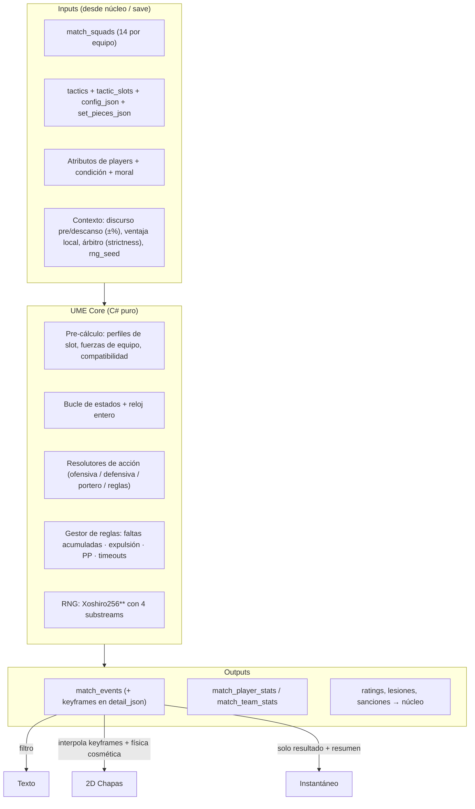
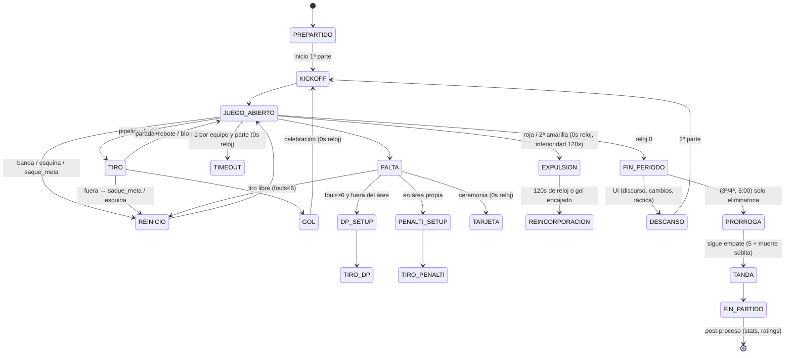

# ⚙️ Especificación del Motor de Partidos — **UniFutsal Match Engine (UME)**
### Documento técnico · v1.0 · Última pieza antes de codificar M1–M4

> **Rol:** define el algoritmo que convierte **atributos × rol táctico × contexto → una secuencia determinista de eventos** (`match_events`) que alimentan los tres presentadores (texto, 2D chapas, instantáneo) según el principio «una simulación, tres presentadores» (RF-601). Implementa en una librería C# pura, headless, sin dependencia de Unity.
>
> **Referencias cruzadas:** tipos de eventos y tablas de stats = Modelo de Datos v1.0.1 (D5) · reglas = RF-602 · determinismo = RF-608 · rendimiento = RNF-02/RNF-08 · constantes = **valores iniciales v0, se afinan en calibración (§15)**.

---

## 1. Principios de diseño (no negociables)

1. **La física es cosmética; la probabilidad decide.** Cada acción se resuelve con RNG ponderado por atributos. La capa 2D interpola y adorna, nunca decide.
2. **Determinismo total:** misma seed → misma secuencia de eventos, bit a bit, en la misma plataforma. Sin lecturas de reloj, sin paralelismo interno, sin `Math.Pow`/trascendentes (solo `+ - * /` y comparaciones).
3. **Resolución discreta sobre reloj entero:** el partido avanza en pasos de acción que consumen segundos enteros de reloj parado. 2×20:00 + prórroga 2×5:00.
4. **Todo evento relevante es persistible y reversible a texto:** el stream ES el partido; los presentadores son filtros/renderizadores.
5. **Calibrable sin recompilar:** todas las constantes viven en un `MatchEngineConfig` (JSON) editable, con valores por defecto versionados.

---

## 2. Arquitectura del pipeline



**Emisión selectiva (RNF-08):** el motor genera internamente el log completo de pasos de acción (~1.500–2.500 por partido), pero solo **persiste** la totalidad cuando `matches.full_events = 1` (partidos que el usuario ve o veNe a ver). Los partidos de fondo guardan solo los eventos notables (tabla §13) + resultado y stats. Un partido pasado sin stream se puede ver en texto mejorado (eventos notables) — el replay 2D retro requiere el flag activado en el momento.

---

## 3. Modelo de pista, slots y coordenadas

Pista 40×20 m: `x ∈ [0,40]`, `y ∈ [0,20]`. Cada formación define **anclas de slot** (coordenada base + rectángulo funcional). Los jugadores derivan su posición cosmética de su slot + atracción al balón + ruido (visual); **funcionalmente**, lo que importa es la zona (`x<13` defensa · `13–27` medio · `x>27` ataque) y el rol del slot.

| Formación | Slots de campo (rol → ancla base local→atacante) | Perfil dominante |
| :--- | :--- | :--- |
| **4-0** | línea de 4 rotando: `CIE` `UNI` `ALI` `ALD` en x≈10→30, sin pívot fijo | rotación continua, sin referencia |
| **3-1** | 3 atrás (CIE-UNI-UNI) x≈12 · **PIV** alto x≈33 y=10 | juego de fijos, paredes |
| **2-2** | 2 atrás x≈11 · 2 arriba x≈29 | estructura simple, transición |
| **1-2-1 (rombo)** | CIE x≈9 · ALI/ALD x≈22 y=4/16 · PIV x≈31 | rombo clásico, apoyo diagonal |
| **1-3** | CIE x≈10 · línea de 3 x≈28 | amplitud, tiro exterior |
| **Portero** | x≈2,5 (sube hasta x≈12 en PP como `portero_jugador`) | `g_*` |

**Compatibilidad slot↔posición natural** (misma matriz que los anillos de la pizarra WF-04 y que la IA de sustituciones):

| De \ A | POR | CIE | ALI | ALD | PIV | UNI |
| :-- | :-: | :-: | :-: | :-: | :-: | :-: |
| POR | 1.00 | .40 | .30 | .30 | .25 | .55 |
| CIE | — | 1.00 | .80 | .80 | .70 | **.92** |
| ALI/ALD | — | .80 | 1.00 / .95 | .95 / 1.00 | .75 | **.92** |
| PIV | — | .70 | .75 | .75 | 1.00 | .88 |
| UNI | — | .92 | .92 | .92 | .88 | 1.00 |

---

## 4. Atributos efectivos

`norm(A) = (A − 1) / 19 ∈ [0,1]`. Para cada jugador en cancha:

```
A_eff = clamp(1, 20, A_base × f_cond × f_morale × f_momentum)
```

| Factor | Fórmula (v0) | Rango |
| :--- | :--- | :--- |
| **Condición** `f_cond` | piecewise: cond≥80 → 1.00 · 60–80 → 0.92–1.00 · 40–60 → 0.80–0.92 · <40 → 0.65–0.80 (lineal por tramo) | 0.65–1.00 |
| **Moral** `f_morale` | `0.95 + 0.10 × (moral/100)` | 0.95–1.05 |
| **Momentum** `f_momentum` | ±0.03 según racha reciente del equipo (§11) | 0.97–1.03 |
| **Discurso** (input) | ±0.02 por la parte | 0.98–1.02 |
| **Ventaja local** (input) | +0.015 ofensiva al local si asistencia > 50 % aforo | +1.5 % |

**Carga de fatiga:** cada paso suma `load += dt × (0.6 + intensidad_acción)` donde la intensidad va de 0.8 (pase estático) a 2.2 (conducción al sprint, presión alta). Capacidad por jugador: `cap_min = 34 + 1.8 × p_resistencia` minutos de reloj (≈ 41–70 min). `condición = 100 × (1 − load / (cap_min×60))`. Los 5 en cancha se fatigan; **los cambios ilimitados son la gestión central del futsal**.

---

## 5. Fuerzas agregadas de equipo

Pre-calculadas al inicio y recalculadas en cada cambio (gol, cambio, PP):

```
ATK = Σ_slots w_slot·(perfil_ofensivo) · mod_formación_of · (1 ± 0.02·(ATK_rival−DEF_propia))  … cap ±15 %
DEF = Σ_slots w_slot·(perfil_defensivo) · mod_formación_def
BUILD = media ponderada (t_pase, m_vision) de CIE/UNI + g_juego_pies del POR
TRA   = media (p_velocidad, p_aceleracion) de los 4 de campo + mod presión
```

Se usan como **modificadores de base** en todos los resolutores (`1 + 0.02×(ATK_propia − DEF_rival)`, acotado ±0.15), nunca como dado único: las acciones individuales siempre miran atributos del actor y del oponente directo.

---

## 6. Máquina de estados y reloj



**Coste de reloj por acción (segundos enteros, v0):**

| Acción | dt | Notas |
| :--- | :-: | :--- |
| Pase corto/medio/largo | 1 / 1–2 / 2–3 | +1 si receptor contestado |
| Conducción (por tramo 5 m) | 2 | 1 si `p_velocidad ≥ 16` |
| Regate 1v1 | 2 | |
| Preparación de tiro | 1 | incluido en pipeline |
| Saque de banda / meta / esquina | 3 / 3 / 4 | meta: 2 si `g_distribucion ≥ 14` |
| Tiro libre (fouls<6) | 4 | |
| **Doble penalti (setup+tiro)** | 8 | evento con zoom en 2D |
| **Penalti (6 m)** | 6 | |
| Gol → saque de centro | 6 | reloj parado durante celebración: se aplica solo el reset |
| Parada con retención | +3 | GK saca de nuevo |
| Timeout / tarjeta / lesión / cambio / prórroga-setup | 0 | reloj parado; los estados de parada no consumen |
| **Prórroga** | periodos 3ª/4ª = **300 s** c/u | contadores de faltas se reinician por periodo |

El periodo termina en cuanto el reloj llega a 0 tras completar la acción en curso (sin balón en el aire).

---

## 7. El bucle de posesión (pseudocódigo núcleo)

```csharp
while (!partidoTerminado) {
    switch (estado) {
      case JUEGO_ABIERTO:
        var portador = posesion.portador;
        var presion  = CalcularPresion();                    // [0..1], §9.1
        var accion   = ElegirAccion(portador, contexto);     // utilidad softmax, §8
        int dt = CosteReloj(accion, portador);
        AvanzarReloj(dt);                                    // puede cerrar periodo
        if (reloj == 0) { Emitir(FIN_PERIODO); estado = FIN_PERIODO; break; }
        var res = Resolver(accion, portador, presion);       // §8–§10
        Emitir(res.eventos);                                 // con keyframes
        Aplicar(res.nuevoEstado);                            // posesión, marcador, fatiga
        ActualizarFatiga(enCancha, dt, accion);
        AutoGestionarIA();                                   // cambios/timeouts/PP, §12
        break;
      case REINICIO: ResolverReinicio(); break;
      case DP_SETUP: ResolverDP(); break;                    // §10
      /* ... otros estados ... */
    }
}
```

---

## 8. Motor ofensivo — catálogo de acciones y resolución

### 8.1 Selección de acción (utilidad softmax)

Para el portador se generan los candidatos disponibles según zona, slot, formación y presión; cada uno puntúa:

```
U(a) = P_exito(a) × V_gol(a) − P_perdida(a) × V_riesgo(a) + V_posicional(a) + ε_ruido
P_elegida ∝ softmax(U / T)     con T (temperatura) = 0.8 base
   T baja cuando: m_decision alta, m_serenidad alta, partido controlado
   T alta cuando: perdiendo tarde, pressing rival alto, m_arrojo alto
```

### 8.2 Catálogo (attrs primarios → secundarios · fórmulas v0)

| # | Acción | Condición de disponibilidad | Atributos del actor | Oponente directo | P_exito base (v0) | Evento(s) resultante |
| :-: | :--- | :--- | :--- | :--- | :--- | :--- |
| 1 | **Pase a X** (corto/medio/largo) | siempre (línea de pase estimada) | `t_pase`, `m_vision` (+`t_pase_un_toque` si un toque) | interceptador: `t_intercepcion`, `m_anticipacion` | corto .93 · medio .86 · largo .74 · cruzado .68, ×(1−0.35·presión) ×modBUILD, −riesgo por tipo (progresivo −0.06) | éxito: `otro/pase` + keyframe · fallo: 60 % `otro/robo` (posesión rival), 40 % banda rival |
| 2 | **Conducción** (avanza 5–8 m) | espacio frontal | `t_conduccion`, `p_aceleracion`, `p_velocidad` | `p_agilidad`, `p_velocidad` | .75 × (1+0.03·(A_conducción − D_defensa)) | éxito: avance + keyframe · fallo: 40 % retorno, 35 % `otro/robo`, 25 % **enga gesta falta rival** (va a §10.1) |
| 3 | **Regate 1v1** | rival al frente, zona amplia | `t_regate`, `p_equilibrio` | `t_entrada`, `p_agilidad` | .45 + 0.02·(regate−entrada), ×(1−0.3·presión) | éxito: desequilibrio (+0.15 a siguiente acción) · fallo: 55 % robo, 45 % falta rival |
| 4 | **Pared con pívot** (3-1/rombo) | PIV en cancha y táctica "juego de fijos" | `t_pase`, `m_vision`; PIV: `t_poste` | cierre: `m_posicionamiento` | .78 × comp(PIV) | generación de ocasión; si rompe línea → tiro o entrada al área |
| 5 | **Entrada al pívot** | PIV de espaldas en x>27 | pasador `t_pase` · PIV `t_control` | PIV marcador: `t_entrada`, `p_fuerza` | .70 | PIV recibe de espaldas → abre ramas 6/7 |
| 6 | **Giro y tiro del pívot** | rama 5 exitosa | `t_poste`, `t_finalizacion`, `m_serenidad` | GK pipeline §9 | pipeline | `tiro` |
| 7 | **Pase atrás/lanzamiento tras giro** | rama 5 exitosa | `t_pase`, `m_decision` | línea rival | .80 | reorganiza posesión |
| 8 | **Tiro** (desde juego) | en zona de tiro o tras desequilibrio | `t_finalizacion` (≤7 m), `t_tiro_lejano` (>7 m), `m_serenidad` | GK §9 + bloqueador `t_bloqueo` | **pipeline §9.2** | `tiro` → `gol`/`parada`/`ocasion_fallada`/`otro/bloqueo` |
| 9 | **Reconducir / volver al POR** | presión ≥ 0.75 o sin progresión | `m_decision`, `t_pase` | pressing rival | .92 | baja presión, reinicia BUILD; en PP: ⚠ riesgo neto vacío |
| 10 | **Provocar falta** (búsqueda de DP) | rival con ≥5 faltas en el periodo | `t_regate`, `m_decision` | `h_juego_duro`, `m_agresividad` rival | bonus +0.10 a caer en contacto | si silba: **DP** (§10.1) — la IA buena caza esta regla |

**Pressing modula todo:** presión alta rival → +0.08 presión efectiva, +15 % probabilidad de pérdida en acciones 1–3, pero +0.6 de fatiga extra por paso para el equipo que presiona, y +20 % en su propia probabilidad de cometer falta.

### 8.3 Zonas de tiro (multiplicador de calidad)

| Zona (x,y del tirador) | mod_q |
| :--- | :-: |
| Central ≤6 m, ángulo abierto | +0.20 |
| Central 6–10 m | +0.10 |
| Lateral ≤6 m (ángulo cerrado) | 0.00 |
| >10 m, central | −0.05 |
| >10 m, lateral | −0.15 |
| 1v1 tras robo en campo rival (transición) | +0.25 |

---

## 9. Pipeline de tiro y portero

### 9.1 Presión (calculada cada paso)

```
presion = clamp01( 0.9×e^(−dist_rival_más_cercano / 3m) + 0.25×(pressing rival) − 0.1×(apoyo libre) )
```

### 9.2 Resolución de tiro (el tramo más calibrado del motor)

```
q = clamp01( 0.45×norm(t_final|t_tiro_lejano según dist)      // calidad del tirador
           + 0.15×norm(m_serenidad)
           + zona_mod (§8.3)
           + 0.10×(1 − presion)
           + 0.05×(nº toques previos en la jugada /4)         // acciones previas = ocasión trabajada
           − 0.02×fatiga )

gk_factor = 1 − (0.50×norm(g_reflejos) + 0.25×norm(g_posicionamiento) + 0.25×norm(g_paradas))
            → rango típico 0.25 (GK elite) – 0.55 (GK medio)   [0.05 si Portería-Jugador: red vacía]

bloqueo = prob de t_bloqueo del defensor en línea (si aplica)
P_gol   = q × gk_factor × (1 − bloqueo_prob)
```

**Partición del resto (v0):** si no es gol →
- `parada` 62 % (del remanente): de ellas → rebote corto 30 % (posesión viva, segundo palo), rechace a banda 20 %, esquina 20 %, GK retiene 30 % (`saque_meta`).
- `ocasion_fallada` 30 %: fuera / al cuerpo sin problema → `saque_meta`.
- `otro/bloqueo` 8 % si había bloqueador: → esquina 35 % / posesión rival 65 %.

---

## 10. Reglas especiales (gestor de reglas)

### 10.1 Faltas acumuladas y Doble Penalti

Contadores `faltas[side][periodo]`. Al silbarse una falta del equipo S en el periodo P:

1. `faltas[S][P] += 1` → evento `falta` con `detail_json.falta_equipo = faltas`.
2. **¿En área propia de S?** → `penalti` (6 m) — incondicional.
3. **¿`faltas ≥ 6`?** → `doble_penalti` (10 m, sin barrera).
4. Si no → tiro libre (reinicio, 0 s de reloj de preparación, dt 4).

**Resolución DP:** `P_gol = clamp(0.15, 0.85, 0.30 + 0.22×norm(t_final) + 0.18×norm(t_tiro_lejano) + 0.10×norm(m_serenidad) − 0.28×norm(g_reflejos) − 0.12×norm(g_uno_con_uno))` → objetivo medio ≈ **45–55 %**. Eventos: `doble_penalti` (setup) → `tiro` con `detail_json.tipo="dp"` → `gol`/`parada` (rebote en juego). Igual estructura para `penalti` (6 m, +0.08 al P_gol por distancia).

### 10.2 Tarjetas y expulsión temporal

En cada falta, prob de tarjeta (modulada por `strictness` del árbitro §14): amarilla base 0.12 (×1.8 si falta táctica en contraataque, ×1.5 si `m_agresividad` alta); 2ª amarilla → roja. Roja directa: 0.02 base (×3 si `h_temperamento` bajo y tras gol encajado).

- `tarjeta_roja`/`expulsion_temporal`: el equipo queda en **4** durante **120 s de reloj** o hasta **encajar gol** → `reincorporacion` (entra un sustituto; el expulsado no vuelve en el partido).
- En inferioridad el equipo defensivo adopta bloque 5v4 (config del pack: rombo/cuadrado, portero normal o parado). El ataque rival recibe +0.12 de presión invertida y las P_exito ofensivas ×1.10.

### 10.3 Power Play y Portero-Jugador (RF-604)

- **Trigger automático IA** (configurable): perdiendo en los últimos 240 s de reloj del partido (o de una eliminación directa en prórroga) → `portero_jugador_on` (sale el GK, entra el 5º de campo; su calidad ofensiva usa `g_jugador` mezclado 50/50 con su perfil base).
- El usuario puede forzarlo desde táctica (`Auto / Sí / No`).
- **Modelo de riesgo:** con red vacía, `gk_factor` del equipo atacante = 0.05 en sus propios tiros, pero si pierde el balón, cualquier tiro rival en transición usa gk_factor 0.10 → los contraataques en contra son letales. `power_play_on/off` + `power_play_seconds` + `pp_goals` en stats de equipo.
- Cancelación: gol propio (empate/ventana), timeout del rival, o quedan >240 s por decisión del manager IA.

### 10.4 Tiempo muerto (1 por equipo y parte; `timeouts_used ≤ 2`)

Efectos: recupera +6 de condición a los 5 en cancha, resetea momentum rival, permite cambio de táctica sin coste. La IA lo usa si: va perdiendo por ≥2 en los últimos 8 min, ha encajado 2 goles en 120 s, o la condición media en cancha <55 % sin cambios útiles. El usuario lo dispara con `T` (WF-05).

### 10.5 Prórroga y tanda

Empate en eliminatoria → periodos 3ª y 4ª de **300 s** (contadores de faltas nuevos por periodo) → si persiste, `tanda`: 5 lanzamientos alternos (orden por mejor `t_finalizacion+m_serenidad` disponible en cancha al 40') + muerte súbita. Cada lanzamiento: `P = 0.62 + 0.18×norm(t_final) − 0.22×norm(g_reflejos_gk_rival) − 0.06×(presión de la situación)` → eventos `tanda` con `detail_json.lanzador, resultado`; resultado a `home_pens/away_pens`.

---

## 11. Momentum (modificador ligero)

Ventana móvil de los últimos 5 eventos con pesos {gol +1.0, parada+doble ocasión +0.3, robo en campo rival +0.2, falta recibida DP +0.3, gol encajado −1.0…}. `f_momentum = clamp(0.97, 1.03, 1 + 0.006×score_momentum)`. Se resetea con timeouts y goles. Es sabor + micro-modulador; **nunca** decide solo un resultado.

---

## 12. IA de gestión de banquillo (equipos no humanos)

| Decisión | Regla (v0) |
| :--- | :--- |
| **Cambio** | si condición < 55 % o al descanso; entrada con mejor `compatibilidad slot` (§3) disponible; nunca agotar los 14 (reserva 1 cambio de emergencia). Frecuencia objetivo: 10–14 cambios por equipo |
| **Portero** | cambio solo por rendimiento (rating <5.0 al descanso) o táctica de PP |
| **PP** | §10.3 |
| **Timeout** | §10.4 |
| **Táctica en vivo** | perdiendo 2+ tras el minuto 30: presión alta + tempo alto; ganando 2+ en el último cuarto: tempo bajo, reconducción; rival con 5 faltas: acción 10 priorizada |
| **Gestión de faltas propias** | con 4 faltas y defensa en zona propia: +contención (−0.10 a engagement defensivo) para no regalar DP |

---

## 13. Mapa de emisión de eventos (contrato con `match_events`)

| `type` (schema D5) | Cuándo se emite | `side` | `person_id` / `secondary` | `detail_json` (campos) | Keyframe |
| :--- | :--- | :-- | :--- | :--- | :-- |
| `gol` | P_gol acierta | autor | autor / asistente | `{"tipo":"jugada"\|"dp"\|"pp"\|"tanda"\|"propia"`, `"dist":m, `"con_asistencia":bool}` | ✅ |
| `tiro` | cada disparo | autor | autor | `{"tipo":"jugada"\|"dp"\|"pen"\|"pp", "dist", "q":0..1}` | ✅ |
| `parada` | GK detiene | GK | GK / tirador | `{"rebote":"vivo"\|"banda"\|"esquina"\|"reta"}` | ✅ |
| `ocasion_fallada` | fuera o gran ocasión perdida | autor | autor | `{"clase":"fuera"\|"cuerpo", "gran":bool}` | ✅ |
| `falta` | cada falta silbada | infractor | infractor / víctima | `{"falta_equipo":n, "zona":"area"\|"juego"}` | ✅ |
| `tarjeta_amarilla` / `tarjeta_roja` | ceremonia (0 s) | infractor | — | `{"motivo":"tactica"\|"reiteracion"\|"temperamento", "segunda":bool}` | ❌ |
| `expulsion_temporal` | tras roja | infractor | — | `{"expira_en_s":120}` | ❌ |
| `reincorporacion` | 120 s o gol encajado | equipo | entra | `{"motivo":"tiempo"\|"gol"}` | ✅ |
| `doble_penalti` / `penalti` | setup (8/6 s) | lanzador | — | `{"lanzador_id"}` | ✅ (zoom 10 m/6 m) |
| `timeout` | parada | equipo | — | `{}` | ❌ (overlay) |
| `cambio` | volante (0 s) | sale/entra | sale / entra | `{"slot":n, "cond_salida":pct}` | ❌ |
| `lesion` | evento aleatorio (§14) | lesionado | — | `{"gravedad":1..5}` | ✅ |
| `power_play_on/off`, `portero_jugador_on/off` | §10.3 | equipo | — | `{}` | ✅ |
| `fin_periodo`, `fin_partido` | reloj 0 | — | — | `{"marcador":[h,a]}` | ❌ |
| `tanda` | cada lanzamiento | lanzador | lanzador / GK | `{"orden":n, "resultado":"gol"\|"parada"\|"fuera"}` | ✅ |
| `otro` | todo lo demás (saques y flujo) | equipo | actor | `{"subtipo":"pase"\|"robo"\|"banda"\|"esquina"\|"saque_meta"\|"tiro_libre"\|"bloqueo"\|"saque_centro", …}` | ✅ |

Cada evento persistido con `full_events=1` incluye además `detail_json.kf = {"p":[[x,y]×10],"b":[x,y]}` (0,1 m de precisión) → el 2D interpola entre keyframes con deriva cosmética hacia los anclas de slot (§3).

---

## 14. Árbitro y lesiones

- **Árbitro** (`referees.strictness` 1–20): multiplica prob. de tarjeta ×(0.7 + 0.07×strictness) y añade ±5 % al volumen de faltas silbadas (las no silbadas simplemente no ocurren como evento). `big_match_rating` alto → menos varianza en partidos top.
- **Lesión en partido:** por paso, `P = 3.0e-6 × (1 + intensidad_acción) × norm(h_lesiones) × (2 − f_cond) `…≈ 0.02–0.05 lesiones/partido. Gravedad 1–5 mapea a días de baja (3–90) → tabla `injuries` con `expected_return`. Evento `lesion` + cambio forzado.

---

## 15. Calibración y validación (M4)

**Harness headless:** `ume-cli calibrate --n 10000 --config engine.json` → simula N partidos entre equipos de perfil medio/top y compara distribuciones:

| Métrica | Objetivo (LNFS real ≈) | Rango aceptable |
| :--- | :--- | :--- |
| Goles totales/partido | ~5.5–6.5 | 4.5–7.5 |
| Tiros por equipo | 18–26 | 14–30 |
| % tiros a puerta | ~60 % | 50–70 % |
| Paradas por GK | 8–13 | 6–15 |
| Faltas por equipo | 8–13 | 6–15 |
| Partidos con DP concedido (algún equipo ≥6 faltas) | ~55 % | 40–70 % |
| Conversión DP | ~48 % | 42–55 % |
| Rojas/partido | ~0.08 | 0.03–0.15 |
| Rating medio del mejor en cancha | ~8.2 | — |
| Correlación CA equipo ↔ % victorias (10 temporadas) | fuerte pero no determinista | r = 0.6–0.85 |

**Test de plausibilidad M2/M4 (PRD §6):** 10 temporadas headless → campeones razonables, sin equipos-fantasma, distribución de ratings estable. Gherkin adicional:

```gherkin
Escenario: 6ª falta dentro del área propia
  Dado que el equipo A acumula 5 faltas en el periodo
  Cuando el equipo A comete una falta dentro de su propia área
  Entonces se asigna penalti de 6 m
  Y el contador pasa a 6 pero no se lanza doble penalti

Escenario: Reincorporación por gol en inferioridad
  Dado un jugador expulsado del equipo A hace 80 segundos de reloj
  Cuando el equipo A encaja un gol
  Entonces el equipo A reincorpora a un sustituto inmediatamente
  Y se emite el evento reincorporacion con motivo "gol"

Escenario: Determinismo
  Dado dos simulaciones del mismo partido con rng_seed 12345
  Cuando ambas terminan
  Entonces sus streams de match_events son idénticos byte a byte
```

---

## 16. Determinismo y rendimiento

| Aspecto | Decisión |
| :--- | :--- |
| RNG | **Xoshiro256\*\*** sembrado de `matches.rng_seed` vía SplitMix64; 4 substreams (decisiones, resolución, árbitro, lesiones) por XOR de constantes — el orden de consumo nunca se cruza |
| Aritmética | solo `double` con operaciones básicas IEEE-754 (sin `Math.Pow/Sin/Exp` → reemplazos con polinomios/tablas); determinismo garantizado en la misma plataforma (suficiente para uso personal) |
| Rendimiento | partido completo ≈ 2.000 pasos × O(20) → **< 200 ms** en CPU integrada (RNF-02) · semana de mundo (~120 partidos de fondo) < 2 s (RNF-08) · paralelizable por partido (seeds independientes) |
| Re-simulación | para debug/exhibición: mismo seed + snapshots de táctica → replay exacto |

**Addendum de schema (migración 001):** para permitir re-simulación retro se añade `matches.tactics_home_json / matches.tactics_away_json` (snapshot de la táctica usada). Requiere `ALTER TABLE matches ADD COLUMN tactics_home_json TEXT;` (+ away). Se documenta como cambio menor de `user_version = 2`.

---

## 17. Constantes configurables (`engine.json`, extracto)

| Constante | v0 | afecta a |
| :--- | :-: | :--- |
| `softmax_temp` | 0.8 | agresividad de decisión |
| `dt_*` (tabla §6) | — | ritmo y nº de posesiones |
| `dp_base` | 0.30 | conversión doble penalti |
| `gk_weights [refl,pos,par]` | .50/.25/.25 | pared del portero |
| `foul_base` | 0.10 | volumen de faltas |
| `pp_trigger_s` | 240 | power play automático |
| `load_per_s` | 0.6 + intensidad | curva de fatiga y nº de cambios |
| `home_advantage` | 0.015 | ventaja local |

Todos expuestos en Opciones avanzadas (modo desarrollador) para que **tú mismo calibres a tu gusto sin recompilar**.

---

## Con esto se cierra el paquete de arranque completo: **PRD v1.0 → Libro de Estilos → Modelo de Datos → Wireframes → Especificación del Motor**.

Siguiente entregable natural para arrancar a codificar M1: la **plantilla CSV + validador (RF-910)** para empezar a cargar las plantillas reales (España primero), o el **esqueleto de la solución C#** (estructura de proyectos de la librería núcleo + tests). ¿Cuál prefieres?